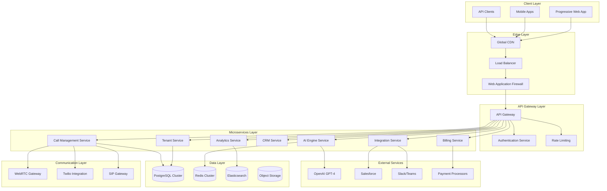
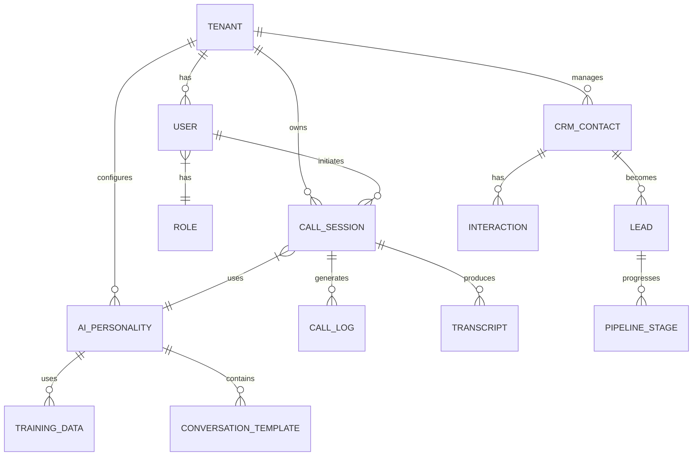

# Design Document: VoiceCore AI 2.0

## Overview

VoiceCore AI 2.0 is architected as a cloud-native, microservices-based platform that leverages modern technologies to deliver enterprise-grade virtual receptionist capabilities. The system employs a multi-tenant architecture with strict data isolation, advanced AI integration, and comprehensive security measures.

The platform is designed to handle massive scale (10,000+ concurrent calls per tenant) while maintaining sub-100ms response times and 99.99% uptime. It integrates cutting-edge AI capabilities with traditional business systems to create a seamless customer service automation platform.

## Architecture

### High-Level Architecture



### Microservices Architecture

The system is decomposed into the following core microservices:

1. **Tenant Management Service**: Handles multi-tenant operations, billing, and resource allocation
2. **Call Management Service**: Orchestrates call routing, queuing, and session management
3. **AI Engine Service**: Manages GPT-4 integration, conversation flow, and learning
4. **CRM Service**: Handles customer data, lead management, and sales pipeline
5. **Analytics Service**: Processes metrics, generates reports, and provides business intelligence
6. **Integration Service**: Manages external API connections and webhook delivery
7. **Billing Service**: Handles usage tracking, pricing, and payment processing
8. **Security Service**: Manages authentication, authorization, and audit logging

### Data Architecture



## Components and Interfaces

### Frontend Components

#### React 18 + TypeScript Architecture

```typescript
// Core Application Structure
interface AppState {
  tenant: TenantContext;
  user: UserContext;
  theme: 'light' | 'dark';
  realTimeConnection: WebSocketConnection;
}

interface TenantContext {
  id: string;
  name: string;
  settings: TenantSettings;
  permissions: Permission[];
}

interface UserContext {
  id: string;
  email: string;
  role: UserRole;
  preferences: UserPreferences;
}
```

#### Key Frontend Components

1. **Dashboard Component**: Real-time metrics and KPI visualization
2. **Call Management Component**: Live call monitoring and control
3. **CRM Component**: Customer and lead management interface
4. **Analytics Component**: Advanced reporting and data visualization
5. **Settings Component**: Tenant and user configuration
6. **Plugin Marketplace Component**: Third-party extension management

### Backend Services

#### API Service Layer

```python
# FastAPI Service Architecture
from fastapi import FastAPI, Depends
from fastapi.middleware.cors import CORSMiddleware
from fastapi.middleware.gzip import GZipMiddleware

class VoiceCoreAPI:
    def __init__(self):
        self.app = FastAPI(
            title="VoiceCore AI 2.0 API",
            version="2.0.0",
            docs_url="/api/docs"
        )
        self.setup_middleware()
        self.setup_routes()
    
    def setup_middleware(self):
        self.app.add_middleware(CORSMiddleware)
        self.app.add_middleware(GZipMiddleware)
        self.app.add_middleware(SecurityMiddleware)
        self.app.add_middleware(TenantIsolationMiddleware)
```

#### Core Service Interfaces

```python
from abc import ABC, abstractmethod
from typing import List, Optional, Dict, Any

class TenantService(ABC):
    @abstractmethod
    async def create_tenant(self, tenant_data: TenantCreateRequest) -> Tenant:
        pass
    
    @abstractmethod
    async def get_tenant_settings(self, tenant_id: str) -> TenantSettings:
        pass

class CallManagementService(ABC):
    @abstractmethod
    async def initiate_call(self, call_request: CallRequest) -> CallSession:
        pass
    
    @abstractmethod
    async def route_call(self, call_session: CallSession) -> RoutingDecision:
        pass

class AIEngineService(ABC):
    @abstractmethod
    async def process_conversation(self, message: ConversationMessage) -> AIResponse:
        pass
    
    @abstractmethod
    async def analyze_sentiment(self, text: str) -> SentimentAnalysis:
        pass
```

### WebRTC Gateway

```python
class WebRTCGateway:
    def __init__(self):
        self.peer_connections: Dict[str, RTCPeerConnection] = {}
        self.media_streams: Dict[str, MediaStream] = {}
    
    async def create_peer_connection(self, session_id: str) -> RTCPeerConnection:
        """Create WebRTC peer connection for voice/video calls"""
        pass
    
    async def handle_offer(self, session_id: str, offer: RTCSessionDescription):
        """Handle WebRTC offer from client"""
        pass
    
    async def handle_answer(self, session_id: str, answer: RTCSessionDescription):
        """Handle WebRTC answer from client"""
        pass
```

## Data Models

### Core Data Models

```python
from sqlalchemy import Column, String, DateTime, Boolean, Integer, Text, JSON
from sqlalchemy.ext.declarative import declarative_base
from sqlalchemy.dialects.postgresql import UUID
import uuid

Base = declarative_base()

class Tenant(Base):
    __tablename__ = "tenants"
    
    id = Column(UUID(as_uuid=True), primary_key=True, default=uuid.uuid4)
    name = Column(String(255), nullable=False)
    domain = Column(String(255), unique=True, nullable=False)
    settings = Column(JSON, nullable=False, default={})
    subscription_tier = Column(String(50), nullable=False, default="free")
    created_at = Column(DateTime, nullable=False)
    updated_at = Column(DateTime, nullable=False)
    is_active = Column(Boolean, default=True)

class CallSession(Base):
    __tablename__ = "call_sessions"
    
    id = Column(UUID(as_uuid=True), primary_key=True, default=uuid.uuid4)
    tenant_id = Column(UUID(as_uuid=True), nullable=False)
    caller_phone = Column(String(20), nullable=False)
    session_type = Column(String(20), nullable=False)  # voice, video, chat
    status = Column(String(20), nullable=False)  # active, completed, failed
    ai_personality_id = Column(UUID(as_uuid=True), nullable=True)
    started_at = Column(DateTime, nullable=False)
    ended_at = Column(DateTime, nullable=True)
    duration_seconds = Column(Integer, nullable=True)
    metadata = Column(JSON, default={})

class AIPersonality(Base):
    __tablename__ = "ai_personalities"
    
    id = Column(UUID(as_uuid=True), primary_key=True, default=uuid.uuid4)
    tenant_id = Column(UUID(as_uuid=True), nullable=False)
    name = Column(String(255), nullable=False)
    voice_settings = Column(JSON, nullable=False)
    conversation_style = Column(Text, nullable=False)
    knowledge_base = Column(JSON, default={})
    training_data = Column(JSON, default={})
    is_active = Column(Boolean, default=True)

class CRMContact(Base):
    __tablename__ = "crm_contacts"
    
    id = Column(UUID(as_uuid=True), primary_key=True, default=uuid.uuid4)
    tenant_id = Column(UUID(as_uuid=True), nullable=False)
    first_name = Column(String(100), nullable=False)
    last_name = Column(String(100), nullable=False)
    email = Column(String(255), nullable=True)
    phone = Column(String(20), nullable=True)
    company = Column(String(255), nullable=True)
    lead_score = Column(Integer, default=0)
    tags = Column(JSON, default=[])
    custom_fields = Column(JSON, default={})
    created_at = Column(DateTime, nullable=False)
    updated_at = Column(DateTime, nullable=False)
```

### Analytics Data Models

```python
class CallAnalytics(Base):
    __tablename__ = "call_analytics"
    
    id = Column(UUID(as_uuid=True), primary_key=True, default=uuid.uuid4)
    tenant_id = Column(UUID(as_uuid=True), nullable=False)
    call_session_id = Column(UUID(as_uuid=True), nullable=False)
    sentiment_score = Column(Integer, nullable=True)  # -100 to 100
    emotion_detected = Column(String(50), nullable=True)
    language_detected = Column(String(10), nullable=True)
    keywords_extracted = Column(JSON, default=[])
    call_outcome = Column(String(50), nullable=True)
    customer_satisfaction = Column(Integer, nullable=True)  # 1-5 scale
    ai_confidence_score = Column(Integer, nullable=True)  # 0-100

class BusinessMetrics(Base):
    __tablename__ = "business_metrics"
    
    id = Column(UUID(as_uuid=True), primary_key=True, default=uuid.uuid4)
    tenant_id = Column(UUID(as_uuid=True), nullable=False)
    metric_date = Column(DateTime, nullable=False)
    total_calls = Column(Integer, default=0)
    successful_calls = Column(Integer, default=0)
    average_call_duration = Column(Integer, default=0)
    customer_satisfaction_avg = Column(Integer, default=0)
    leads_generated = Column(Integer, default=0)
    conversion_rate = Column(Integer, default=0)  # percentage * 100
    revenue_attributed = Column(Integer, default=0)  # cents
```

Now I need to use the prework tool to analyze the acceptance criteria before writing the Correctness Properties section.

<function_calls>
<invoke name="prework">
<parameter name="featureName">voicecore-ai-2.0

## Correctness Properties

*A property is a characteristic or behavior that should hold true across all valid executions of a system—essentially, a formal statement about what the system should do. Properties serve as the bridge between human-readable specifications and machine-verifiable correctness guarantees.*

Based on the prework analysis, I've identified several key properties that can be combined for comprehensive testing coverage. After reviewing all testable properties, I've eliminated redundancy and consolidated related properties into comprehensive tests.

### Property Reflection

After analyzing all acceptance criteria, I identified several areas where properties could be consolidated:
- Multiple UI responsiveness properties can be combined into comprehensive interface testing
- Various AI capabilities can be tested through unified AI behavior properties
- Security and compliance features can be grouped into comprehensive security properties
- Performance requirements can be consolidated into scalability properties
- Integration capabilities can be tested through unified external system properties

### Core System Properties

**Property 1: Responsive UI Adaptation**
*For any* viewport size and device type, the VoiceCore interface should adapt correctly maintaining usability and visual hierarchy across all screen dimensions
**Validates: Requirements 1.2**

**Property 2: Theme Persistence**
*For any* user theme preference (dark/light), switching themes should immediately update the interface and persist the preference across sessions
**Validates: Requirements 1.3**

**Property 3: Real-time WebSocket Updates**
*For any* system event that triggers UI updates, the interface should reflect changes immediately via WebSocket connections without requiring page refresh
**Validates: Requirements 1.4**

**Property 4: Dashboard Customization Persistence**
*For any* drag-and-drop dashboard modification, the changes should be saved and restored correctly when the user returns to the dashboard
**Validates: Requirements 1.5**

**Property 5: Data Visualization Accuracy**
*For any* dataset provided to charting components, the visualizations should accurately represent the data with correct scales, labels, and values
**Validates: Requirements 1.6**

**Property 6: PWA Offline Functionality**
*For any* core application feature, the PWA should continue to function when offline and sync changes when connectivity is restored
**Validates: Requirements 1.7**

### AI Engine Properties

**Property 7: Multi-language Conversation Support**
*For any* conversation in supported languages (English, Spanish, French, German, Italian, Portuguese), the AI should respond appropriately in the same language
**Validates: Requirements 2.2**

**Property 8: Real-time Translation Accuracy**
*For any* multi-language conversation, the translation service should provide accurate real-time translation maintaining context and meaning
**Validates: Requirements 2.3**

**Property 9: Sentiment Analysis Consistency**
*For any* text input, the sentiment analysis should produce consistent sentiment scores and emotional state detection across similar content
**Validates: Requirements 2.4**

**Property 10: AI Personality Isolation**
*For any* tenant with custom AI personality settings, the AI responses should reflect only that tenant's personality configuration without cross-tenant contamination
**Validates: Requirements 2.7**

**Property 11: AI Learning Improvement**
*For any* AI training session with feedback data, the AI responses should demonstrably improve over time when measured against the same test scenarios
**Validates: Requirements 11.1**

### CRM and Analytics Properties

**Property 12: CRM Data Integrity**
*For any* CRM operation (create, read, update, delete), the data should maintain referential integrity and be accessible only to authorized users within the correct tenant
**Validates: Requirements 3.1**

**Property 13: Real-time Metrics Accuracy**
*For any* business metric calculation, the dashboard should display accurate real-time values that match the underlying data within acceptable latency bounds
**Validates: Requirements 3.2**

**Property 14: Report Generation Consistency**
*For any* report configuration and dataset, the generated reports should produce consistent results across multiple generations with the same parameters
**Validates: Requirements 3.3**

**Property 15: Data Export Format Validity**
*For any* data export request, the generated files (Excel, PDF, PowerBI) should be valid, complete, and readable by their respective applications
**Validates: Requirements 3.7**

### Integration Properties

**Property 16: External Integration Reliability**
*For any* external service integration (Slack, Teams, Salesforce, HubSpot), data synchronization should maintain consistency and handle failures gracefully with retry logic
**Validates: Requirements 4.1, 4.2**

**Property 17: Authentication Method Compatibility**
*For any* supported authentication method (OAuth 2.0, SAML), users should be able to authenticate successfully and maintain session state across the application
**Validates: Requirements 4.5**

**Property 18: GraphQL API Consistency**
*For any* GraphQL query or mutation, the API should return data that matches the schema definition and maintain consistent response formats
**Validates: Requirements 4.6**

**Property 19: Webhook Delivery Reliability**
*For any* webhook event, the system should deliver the event to registered endpoints with retry logic and maintain delivery guarantees
**Validates: Requirements 4.7, 8.5**

### Security Properties

**Property 20: Multi-Factor Authentication Enforcement**
*For any* user account, MFA should be required for authentication and all MFA methods should function correctly across different scenarios
**Validates: Requirements 5.1**

**Property 21: Audit Log Completeness**
*For any* system activity, comprehensive audit logs should be generated with sufficient detail for compliance and security analysis
**Validates: Requirements 5.2**

**Property 22: Data Privacy Compliance**
*For any* GDPR or HIPAA data request (export, deletion, anonymization), the system should handle the request completely and in compliance with regulations
**Validates: Requirements 5.3, 5.4**

**Property 23: Access Control Enforcement**
*For any* IP whitelisting or geo-restriction rule, the system should correctly allow or deny access based on the configured policies
**Validates: Requirements 5.6**

**Property 24: Encryption Standards Compliance**
*For any* data in transit or at rest, the system should use industry-standard encryption and maintain data confidentiality
**Validates: Requirements 5.7**

### Performance and Scalability Properties

**Property 25: Concurrent Call Capacity**
*For any* load up to 10,000 concurrent calls per tenant, the system should maintain functionality and performance without degradation
**Validates: Requirements 9.1**

**Property 26: API Response Time Compliance**
*For any* API request under normal load conditions, the response time should be within 100 milliseconds
**Validates: Requirements 9.3**

**Property 27: Auto-scaling Responsiveness**
*For any* significant change in system load, the auto-scaling mechanisms should adjust resources appropriately within defined time bounds
**Validates: Requirements 6.2**

**Property 28: Multi-region Consistency**
*For any* data operation across multiple regions, the system should maintain data consistency and availability according to CAP theorem constraints
**Validates: Requirements 6.3**

### Call Management Properties

**Property 29: WebRTC Connection Quality**
*For any* WebRTC voice or video call, the connection should establish successfully and maintain acceptable quality metrics throughout the session
**Validates: Requirements 7.1, 7.2**

**Property 30: Call Transcription Accuracy**
*For any* recorded call, the AI-powered transcription should achieve acceptable accuracy rates and handle various accents and languages
**Validates: Requirements 7.4**

**Property 31: Intelligent Call Routing**
*For any* incoming call, the ML-based routing system should make optimal routing decisions that improve over time with more data
**Validates: Requirements 7.5**

**Property 32: Conversation Summary Quality**
*For any* completed call, the automatic summary should capture key points, outcomes, and action items accurately
**Validates: Requirements 7.7**

### Billing and Monetization Properties

**Property 33: Usage Tracking Accuracy**
*For any* billable event in the system, the usage should be tracked accurately and reflected correctly in billing calculations
**Validates: Requirements 10.5**

**Property 34: Pricing Model Consistency**
*For any* pricing tier or custom plan, the billing calculations should be consistent and accurate across different usage patterns
**Validates: Requirements 10.1, 10.2**

**Property 35: Revenue Sharing Calculation**
*For any* third-party plugin transaction, the revenue sharing should be calculated correctly according to the agreed percentages
**Validates: Requirements 10.3, 8.6**

## Error Handling

### Error Classification

The system implements a comprehensive error handling strategy with the following error categories:

1. **Client Errors (4xx)**: Invalid requests, authentication failures, authorization issues
2. **Server Errors (5xx)**: Internal system failures, external service unavailability
3. **Business Logic Errors**: Validation failures, constraint violations, workflow errors
4. **Integration Errors**: External API failures, webhook delivery failures, timeout errors

### Error Handling Patterns

```python
from enum import Enum
from typing import Optional, Dict, Any
from dataclasses import dataclass

class ErrorCode(Enum):
    # Authentication & Authorization
    INVALID_CREDENTIALS = "AUTH_001"
    MFA_REQUIRED = "AUTH_002"
    INSUFFICIENT_PERMISSIONS = "AUTH_003"
    
    # Tenant & Resource Management
    TENANT_NOT_FOUND = "TENANT_001"
    RESOURCE_LIMIT_EXCEEDED = "TENANT_002"
    INVALID_TENANT_STATE = "TENANT_003"
    
    # Call Management
    CALL_SETUP_FAILED = "CALL_001"
    WEBRTC_CONNECTION_FAILED = "CALL_002"
    TRANSCRIPTION_FAILED = "CALL_003"
    
    # AI Engine
    AI_SERVICE_UNAVAILABLE = "AI_001"
    INVALID_AI_RESPONSE = "AI_002"
    TRAINING_DATA_INVALID = "AI_003"
    
    # External Integrations
    EXTERNAL_API_FAILURE = "EXT_001"
    WEBHOOK_DELIVERY_FAILED = "EXT_002"
    SYNC_CONFLICT = "EXT_003"

@dataclass
class ErrorResponse:
    code: ErrorCode
    message: str
    details: Optional[Dict[str, Any]] = None
    correlation_id: str = None
    timestamp: str = None
    
class ErrorHandler:
    def __init__(self):
        self.retry_policies = {
            ErrorCode.EXTERNAL_API_FAILURE: RetryPolicy(max_attempts=3, backoff_factor=2),
            ErrorCode.WEBHOOK_DELIVERY_FAILED: RetryPolicy(max_attempts=5, backoff_factor=1.5),
        }
    
    async def handle_error(self, error: Exception, context: Dict[str, Any]) -> ErrorResponse:
        """Central error handling with logging, monitoring, and recovery"""
        pass
```

### Circuit Breaker Pattern

```python
class CircuitBreaker:
    def __init__(self, failure_threshold: int = 5, recovery_timeout: int = 60):
        self.failure_threshold = failure_threshold
        self.recovery_timeout = recovery_timeout
        self.failure_count = 0
        self.last_failure_time = None
        self.state = "CLOSED"  # CLOSED, OPEN, HALF_OPEN
    
    async def call(self, func, *args, **kwargs):
        """Execute function with circuit breaker protection"""
        if self.state == "OPEN":
            if self._should_attempt_reset():
                self.state = "HALF_OPEN"
            else:
                raise CircuitBreakerOpenError()
        
        try:
            result = await func(*args, **kwargs)
            self._on_success()
            return result
        except Exception as e:
            self._on_failure()
            raise e
```

## Testing Strategy

### Dual Testing Approach

The VoiceCore AI 2.0 system employs a comprehensive dual testing strategy combining unit tests and property-based tests to ensure both specific functionality and universal correctness.

**Unit Testing Focus:**
- Specific examples and edge cases for critical business logic
- Integration points between microservices
- Error conditions and failure scenarios
- API endpoint behavior with known inputs
- Database operations and data integrity

**Property-Based Testing Focus:**
- Universal properties that must hold across all inputs
- Comprehensive input coverage through randomization
- Invariant preservation across system operations
- Round-trip properties for serialization/deserialization
- Metamorphic properties for complex business logic

### Property-Based Testing Configuration

**Testing Framework:** Hypothesis (Python) for backend services, fast-check (TypeScript) for frontend components

**Test Configuration:**
- Minimum 100 iterations per property test to ensure statistical significance
- Each property test references its corresponding design document property
- Tag format: **Feature: voicecore-ai-2.0, Property {number}: {property_text}**
- Seed-based reproducibility for debugging failed test cases

**Example Property Test Structure:**

```python
import hypothesis.strategies as st
from hypothesis import given, settings

@given(
    tenant_id=st.uuids(),
    viewport_width=st.integers(min_value=320, max_value=3840),
    viewport_height=st.integers(min_value=240, max_value=2160)
)
@settings(max_examples=100)
def test_responsive_ui_adaptation(tenant_id, viewport_width, viewport_height):
    """
    Feature: voicecore-ai-2.0, Property 1: Responsive UI Adaptation
    For any viewport size and device type, the VoiceCore interface should 
    adapt correctly maintaining usability and visual hierarchy
    """
    # Test implementation
    pass

@given(
    conversation_text=st.text(min_size=10, max_size=1000),
    source_language=st.sampled_from(['en', 'es', 'fr', 'de', 'it', 'pt']),
    target_language=st.sampled_from(['en', 'es', 'fr', 'de', 'it', 'pt'])
)
@settings(max_examples=100)
def test_real_time_translation_accuracy(conversation_text, source_language, target_language):
    """
    Feature: voicecore-ai-2.0, Property 8: Real-time Translation Accuracy
    For any multi-language conversation, the translation service should 
    provide accurate real-time translation maintaining context and meaning
    """
    # Test implementation
    pass
```

### Integration Testing Strategy

**Microservices Integration:**
- Contract testing between services using Pact
- End-to-end workflow testing across service boundaries
- Database transaction testing with rollback scenarios
- Message queue reliability testing

**External Integration Testing:**
- Mock external services for consistent testing
- Real integration testing in staging environments
- Webhook delivery testing with various failure scenarios
- OAuth/SAML flow testing with multiple providers

### Performance Testing

**Load Testing:**
- Gradual load increase to identify breaking points
- Concurrent user simulation up to specified limits
- Database performance under high query loads
- WebRTC connection stress testing

**Scalability Testing:**
- Auto-scaling trigger validation
- Multi-region deployment testing
- CDN performance validation
- Cache effectiveness measurement

### Security Testing

**Penetration Testing:**
- Automated security scanning with OWASP ZAP
- Manual penetration testing for critical paths
- SQL injection and XSS vulnerability testing
- Authentication bypass attempt testing

**Compliance Testing:**
- GDPR compliance workflow testing
- HIPAA data handling validation
- Audit log completeness verification
- Data encryption validation