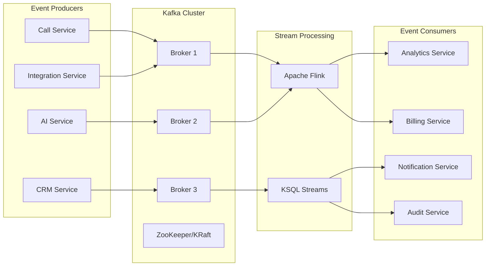

# Design Document: VoiceCore AI 3.0 - Enterprise Edition

## Overview

VoiceCore AI 3.0 Enterprise Edition represents a quantum leap in enterprise virtual receptionist technology, transforming the solid 2.0 foundation into a world-class, Fortune 500-ready platform. This version introduces cutting-edge capabilities including Istio service mesh, Apache Kafka event-driven architecture, vector databases for semantic AI, zero-trust security with HashiCorp Vault, Jaeger distributed tracing, AIOps with predictive analytics, GitOps with ArgoCD, edge computing for ultra-low latency, blockchain audit trails, quantum-ready cryptography, true multi-cloud support, and metaverse integration.

The 3.0 architecture is designed to handle enterprise-scale workloads (1M+ events/second, 100M+ embeddings, 50+ global edge locations) while maintaining sub-10ms latency at the edge and 99.999% uptime. It provides defense-in-depth security, comprehensive observability, and automated operations that rival the most sophisticated enterprise platforms.

### Key Enhancements Over 2.0

- **Service Mesh**: Istio for automatic mTLS, traffic management, and observability
- **Event-Driven**: Apache Kafka for 1M+ events/second with exactly-once semantics
- **Advanced AI**: Vector databases (Pinecone/Weaviate) for semantic search across 100M+ embeddings
- **Zero Trust**: HashiCorp Vault, continuous verification, micro-segmentation
- **AIOps**: Predictive failure detection 30 minutes in advance, automated remediation
- **GitOps**: ArgoCD for declarative deployments, policy-as-code with OPA
- **Edge Computing**: 50+ global locations with sub-10ms processing
- **Blockchain**: Immutable audit trails with smart contract SLA enforcement
- **Quantum-Ready**: Post-quantum cryptography for future-proof security
- **Multi-Cloud**: Seamless deployment across AWS, GCP, Azure, and on-premises
- **Metaverse**: 3D avatar-based customer service in virtual worlds

## Architecture

### High-Level Enterprise Architecture

```mermaid
graph TB
    subgraph "Edge Layer - 50+ Global Locations"
        Edge1[Edge Node US-East]
        Edge2[Edge Node EU-West]
        Edge3[Edge Node APAC]
        EdgeAI[Edge AI Inference]
    end
    
    subgraph "Istio Service Mesh"
        Ingress[Istio Ingress Gateway]
        Envoy[Envoy Proxies]
        Pilot[Pilot - Traffic Management]
        Citadel[Citadel - mTLS]
        Mixer[Mixer - Telemetry]
    end
    
    subgraph "API Gateway & Security"
        Gateway[Kong/Tyk API Gateway]
        Vault[HashiCorp Vault]
        OPA[Open Policy Agent]
        ZeroTrust[Zero Trust Engine]
    end
    
    subgraph "Event-Driven Core - Apache Kafka"
        KafkaBrokers[Kafka Cluster]
        SchemaRegistry[Schema Registry]
        KafkaConnect[Kafka Connect]
        Flink[Apache Flink Stream Processing]
    end
    
    subgraph "Microservices - Enhanced 2.0 Services"
        TenantSvc[Tenant Service]
        CallSvc[Call Management Service]
        AISvc[AI Engine Service]
        CRMSvc[CRM Service]
        AnalyticsSvc[Analytics Service]
        IntegrationSvc[Integration Service]
        BillingSvc[Billing Service]
        SecuritySvc[Security Service]
    end
    
    subgraph "Advanced AI Layer"
        VectorDB[Pinecone/Weaviate Vector DB]
        GPT4Turbo[GPT-4 Turbo + Vision]
        MLflow[MLflow ML Pipeline]
        ModelRegistry[Model Registry]
    end
    
    subgraph "Data Layer - Multi-Cloud"
        PostgresHA[(PostgreSQL HA Cluster)]
        RedisCluster[(Redis Cluster)]
        ElasticsearchCluster[(Elasticsearch Cluster)]
        DataLake[(S3/Azure Data Lake)]
        Presto[Presto/Athena Query Engine]
    end
    
    subgraph "Observability & AIOps"
        Jaeger[Jaeger Distributed Tracing]
        Prometheus[Prometheus Metrics]
        Grafana[Grafana Dashboards]
        AIOps[AIOps Engine]
        ChaosEng[Chaos Engineering]
    end
    
    subgraph "GitOps & IaC"
        ArgoCD[ArgoCD]
        Terraform[Terraform/Pulumi]
        GitRepo[Git Repository]
        PolicyEngine[Policy as Code]
    end
    
    subgraph "Blockchain & Audit"
        Blockchain[Hyperledger/Ethereum]
        SmartContracts[Smart Contracts]
        AuditTrail[Immutable Audit Trail]
    end
    
    subgraph "Digital Twin"
        TwinEngine[Digital Twin Engine]
        Simulation[Load Simulation]
        Optimization[AI Optimization]
    end
    
    subgraph "Metaverse Integration"
        MetaversePlatforms[Decentraland/Sandbox]
        VRInterface[VR/AR Interface]
        SpatialAudio[Spatial Audio Engine]
        NFTAccess[NFT Access Control]
    end
    
    Edge1 --> Ingress
    Edge2 --> Ingress
    Edge3 --> Ingress
    Ingress --> Envoy
    Envoy --> Gateway
    Gateway --> Vault
    Gateway --> OPA
    Gateway --> ZeroTrust
    
    Gateway --> KafkaBrokers
    KafkaBrokers --> Flink
    Flink --> TenantSvc
    Flink --> CallSvc
    Flink --> AISvc
    
    AISvc --> VectorDB
    AISvc --> GPT4Turbo
    AISvc --> MLflow
    
    TenantSvc --> PostgresHA
    CallSvc --> RedisCluster
    AnalyticsSvc --> ElasticsearchCluster
    AnalyticsSvc --> DataLake
    DataLake --> Presto
    
    Envoy --> Jaeger
    Envoy --> Prometheus
    Prometheus --> AIOps
    AIOps --> ChaosEng
    
    ArgoCD --> GitRepo
    ArgoCD --> Terraform
    PolicyEngine --> OPA
    
    SecuritySvc --> Blockchain
    Blockchain --> SmartContracts
    
    TwinEngine --> Simulation
    Simulation --> Optimization
    
    CallSvc --> MetaversePlatforms
    MetaversePlatforms --> VRInterface
```



### Service Mesh Architecture (Istio)

The Istio service mesh provides a dedicated infrastructure layer for managing service-to-service communication with advanced traffic management, security, and observability features.

**Key Components:**

1. **Envoy Proxy**: Sidecar proxy deployed with each service
   - Automatic mTLS encryption
   - Circuit breaking and retry logic
   - Load balancing and traffic routing
   - Metrics collection and distributed tracing

2. **Pilot**: Traffic management and service discovery
   - Dynamic service routing rules
   - Canary deployments and A/B testing
   - Traffic splitting and mirroring
   - Fault injection for testing

3. **Citadel**: Certificate and key management
   - Automatic certificate rotation
   - Service identity and authentication
   - Authorization policies
   - Secure naming

4. **Mixer**: Policy enforcement and telemetry
   - Rate limiting and quotas
   - Access control policies
   - Metrics aggregation
   - Distributed tracing integration


### Event-Driven Architecture (Apache Kafka)

Apache Kafka serves as the central nervous system for event-driven communication, enabling loose coupling, high throughput, and event sourcing capabilities.

**Kafka Architecture:**



**Key Topics:**

- `call.events` - Call lifecycle events (initiated, connected, ended)
- `ai.interactions` - AI conversation events and responses
- `crm.updates` - Customer and lead updates
- `billing.transactions` - Usage and payment events
- `security.audit` - Security and compliance events
- `system.metrics` - Performance and health metrics

**Event Sourcing Pattern:**

All critical business transactions are stored as immutable events, enabling:
- Complete audit trail
- Event replay for debugging
- Temporal queries
- CQRS implementation
- Disaster recovery

### Zero Trust Security Architecture

The zero-trust model assumes no implicit trust and continuously verifies every access request.

**Security Layers:**

1. **Identity Verification** (HashiCorp Vault)
   - Dynamic secrets generation
   - Certificate-based authentication
   - Token-based access control
   - Automatic secret rotation

2. **Network Micro-Segmentation** (Istio + Calico)
   - Service-to-service authorization
   - Network policies per workload
   - East-west traffic encryption
   - Zero-trust networking

3. **Continuous Authentication**
   - Request-level authentication
   - Context-aware access control
   - Behavioral analysis
   - Anomaly detection

4. **Least Privilege Access**
   - Just-in-time access provisioning
   - Time-bound permissions
   - Role-based access control (RBAC)
   - Attribute-based access control (ABAC)


### Edge Computing Architecture

Edge nodes deployed globally provide ultra-low latency processing for voice and AI workloads.

**Edge Node Capabilities:**

- **Voice Processing**: Real-time transcription and analysis within 10ms
- **AI Inference**: Local model execution for instant responses
- **Caching**: Intelligent caching of frequently accessed data
- **Offline Support**: Continue operations during network partitions
- **5G Optimization**: Leverage 5G network slicing and MEC

**Edge Deployment Strategy:**

```
US-East: 5 nodes (New York, Boston, Atlanta, Miami, Washington DC)
US-West: 5 nodes (San Francisco, Los Angeles, Seattle, Portland, Denver)
Europe: 10 nodes (London, Paris, Frankfurt, Amsterdam, Dublin, Madrid, Milan, Stockholm, Warsaw, Zurich)
APAC: 10 nodes (Tokyo, Singapore, Sydney, Hong Kong, Seoul, Mumbai, Bangkok, Jakarta, Manila, Taipei)
LATAM: 5 nodes (São Paulo, Buenos Aires, Mexico City, Santiago, Bogotá)
MEA: 5 nodes (Dubai, Tel Aviv, Johannesburg, Cairo, Nairobi)
```

### AIOps and Observability

AI-powered operations provide predictive analytics, automated remediation, and comprehensive system visibility.

**Observability Stack:**

1. **Distributed Tracing** (Jaeger)
   - End-to-end request tracing
   - Service dependency mapping
   - Performance bottleneck identification
   - Sub-millisecond precision

2. **Metrics Collection** (Prometheus + Datadog)
   - Real-time metrics aggregation
   - Custom business metrics
   - SLI/SLO tracking
   - Alerting and notifications

3. **Log Aggregation** (ELK Stack + Loki)
   - Centralized log management
   - Full-text search
   - Log correlation with traces
   - Compliance logging

4. **AIOps Engine**
   - Anomaly detection using ML
   - Predictive failure analysis
   - Automated root cause analysis
   - Intelligent alerting (reduce noise)
   - Automated remediation workflows

**Chaos Engineering:**

Controlled failure injection to validate system resilience:
- Random pod termination
- Network latency injection
- Resource exhaustion simulation
- Dependency failure simulation
- Multi-region failure scenarios

## Components and Interfaces

### Enhanced Microservices

All 2.0 microservices are enhanced with:
- Istio sidecar proxies for service mesh
- Kafka producers/consumers for event-driven communication
- Vault integration for secrets management
- Jaeger tracing instrumentation
- Prometheus metrics exporters
- Health check endpoints for Kubernetes


### Vector Database Integration

**Pinecone/Weaviate Architecture:**

```python
from typing import List, Dict, Any
import pinecone
from weaviate import Client

class VectorDatabaseService:
    """
    Manages semantic search and AI embeddings across 100M+ vectors
    """
    
    def __init__(self, provider: str = "pinecone"):
        self.provider = provider
        if provider == "pinecone":
            pinecone.init(api_key=vault.get_secret("pinecone_api_key"))
            self.index = pinecone.Index("voicecore-embeddings")
        else:
            self.client = Client("http://weaviate:8080")
    
    async def store_embedding(
        self,
        vector_id: str,
        embedding: List[float],
        metadata: Dict[str, Any]
    ) -> bool:
        """
        Store conversation embedding for semantic search
        Supports 1536-dimensional vectors from GPT-4
        """
        if self.provider == "pinecone":
            self.index.upsert([(vector_id, embedding, metadata)])
        else:
            self.client.data_object.create(
                data_object=metadata,
                class_name="Conversation",
                vector=embedding
            )
        return True
    
    async def semantic_search(
        self,
        query_embedding: List[float],
        top_k: int = 10,
        filters: Dict[str, Any] = None
    ) -> List[Dict[str, Any]]:
        """
        Perform semantic search across all conversations
        Sub-100ms latency for 100M+ vectors
        """
        if self.provider == "pinecone":
            results = self.index.query(
                vector=query_embedding,
                top_k=top_k,
                filter=filters,
                include_metadata=True
            )
            return results.matches
        else:
            results = self.client.query.get(
                "Conversation",
                ["content", "timestamp", "tenant_id"]
            ).with_near_vector({
                "vector": query_embedding
            }).with_limit(top_k).do()
            return results["data"]["Get"]["Conversation"]
    
    async def hybrid_search(
        self,
        query_text: str,
        query_embedding: List[float],
        alpha: float = 0.5
    ) -> List[Dict[str, Any]]:
        """
        Combine keyword and semantic search for best results
        """
        # Weaviate supports hybrid search natively
        if self.provider == "weaviate":
            results = self.client.query.get(
                "Conversation",
                ["content", "timestamp", "tenant_id"]
            ).with_hybrid(
                query=query_text,
                vector=query_embedding,
                alpha=alpha
            ).do()
            return results["data"]["Get"]["Conversation"]
        else:
            # Implement hybrid search for Pinecone
            semantic_results = await self.semantic_search(query_embedding)
            # Combine with keyword search results
            return semantic_results
```

### HashiCorp Vault Integration

**Secrets Management:**

```python
import hvac
from typing import Dict, Any, Optional
from datetime import datetime, timedelta

class VaultService:
    """
    Centralized secrets management with automatic rotation
    """
    
    def __init__(self):
        self.client = hvac.Client(url='https://vault.voicecore.ai')
        self.authenticate()
    
    def authenticate(self):
        """
        Authenticate using Kubernetes service account
        """
        with open('/var/run/secrets/kubernetes.io/serviceaccount/token') as f:
            jwt = f.read()
        
        self.client.auth.kubernetes.login(
            role='voicecore-service',
            jwt=jwt
        )
    
    async def get_secret(self, path: str) -> Dict[str, Any]:
        """
        Retrieve secret from Vault with caching
        """
        secret = self.client.secrets.kv.v2.read_secret_version(
            path=path,
            mount_point='voicecore'
        )
        return secret['data']['data']
    
    async def create_dynamic_db_credentials(
        self,
        tenant_id: str,
        ttl: str = "1h"
    ) -> Dict[str, str]:
        """
        Generate short-lived database credentials
        """
        creds = self.client.secrets.database.generate_credentials(
            name=f'tenant-{tenant_id}',
            mount_point='database'
        )
        return {
            'username': creds['data']['username'],
            'password': creds['data']['password'],
            'expires_at': datetime.now() + timedelta(hours=1)
        }
    
    async def rotate_secret(self, path: str) -> bool:
        """
        Rotate secret and update all dependent services
        """
        # Generate new secret
        new_secret = self._generate_secret()
        
        # Store in Vault
        self.client.secrets.kv.v2.create_or_update_secret(
            path=path,
            secret=new_secret,
            mount_point='voicecore'
        )
        
        # Trigger rolling restart of dependent services
        await self._notify_services(path)
        return True
    
    async def encrypt_data(self, plaintext: str, context: str) -> str:
        """
        Encrypt data using Vault's transit engine
        """
        encrypted = self.client.secrets.transit.encrypt_data(
            name='voicecore-key',
            plaintext=plaintext,
            context=context
        )
        return encrypted['data']['ciphertext']
    
    async def decrypt_data(self, ciphertext: str, context: str) -> str:
        """
        Decrypt data using Vault's transit engine
        """
        decrypted = self.client.secrets.transit.decrypt_data(
            name='voicecore-key',
            ciphertext=ciphertext,
            context=context
        )
        return decrypted['data']['plaintext']
```


### Apache Kafka Event Bus

**Event Producer Interface:**

```python
from confluent_kafka import Producer, Consumer
from confluent_kafka.schema_registry import SchemaRegistryClient
from confluent_kafka.schema_registry.avro import AvroSerializer
from typing import Dict, Any, Callable
import asyncio

class KafkaEventBus:
    """
    High-throughput event bus with exactly-once semantics
    """
    
    def __init__(self):
        self.producer_config = {
            'bootstrap.servers': 'kafka-cluster:9092',
            'client.id': 'voicecore-producer',
            'acks': 'all',  # Wait for all replicas
            'enable.idempotence': True,  # Exactly-once semantics
            'max.in.flight.requests.per.connection': 5,
            'compression.type': 'snappy',
            'linger.ms': 10,  # Batch for 10ms
            'batch.size': 32768  # 32KB batches
        }
        
        self.consumer_config = {
            'bootstrap.servers': 'kafka-cluster:9092',
            'group.id': 'voicecore-consumers',
            'auto.offset.reset': 'earliest',
            'enable.auto.commit': False,  # Manual commit for exactly-once
            'isolation.level': 'read_committed'
        }
        
        self.producer = Producer(self.producer_config)
        self.schema_registry = SchemaRegistryClient({
            'url': 'http://schema-registry:8081'
        })
    
    async def publish_event(
        self,
        topic: str,
        key: str,
        event: Dict[str, Any],
        headers: Dict[str, str] = None
    ) -> bool:
        """
        Publish event with schema validation and exactly-once delivery
        """
        # Serialize with Avro schema
        serializer = AvroSerializer(
            self.schema_registry,
            self._get_schema(topic)
        )
        
        value = serializer(event, None)
        
        # Publish with callback
        self.producer.produce(
            topic=topic,
            key=key.encode('utf-8'),
            value=value,
            headers=headers,
            callback=self._delivery_callback
        )
        
        # Flush to ensure delivery
        self.producer.flush()
        return True
    
    async def consume_events(
        self,
        topics: List[str],
        handler: Callable[[Dict[str, Any]], None]
    ):
        """
        Consume events with automatic retry and dead letter queue
        """
        consumer = Consumer(self.consumer_config)
        consumer.subscribe(topics)
        
        try:
            while True:
                msg = consumer.poll(timeout=1.0)
                if msg is None:
                    continue
                
                if msg.error():
                    await self._handle_error(msg.error())
                    continue
                
                try:
                    # Process message
                    event = self._deserialize(msg.value())
                    await handler(event)
                    
                    # Commit offset after successful processing
                    consumer.commit(message=msg)
                    
                except Exception as e:
                    # Send to dead letter queue
                    await self._send_to_dlq(msg, e)
                    consumer.commit(message=msg)
        
        finally:
            consumer.close()
    
    async def replay_events(
        self,
        topic: str,
        start_timestamp: int,
        end_timestamp: int
    ) -> List[Dict[str, Any]]:
        """
        Replay events for debugging or recovery
        """
        consumer = Consumer(self.consumer_config)
        
        # Seek to timestamp
        partitions = consumer.list_topics(topic).topics[topic].partitions
        for partition_id in partitions:
            partition = TopicPartition(topic, partition_id, start_timestamp)
            consumer.assign([partition])
        
        events = []
        while True:
            msg = consumer.poll(timeout=1.0)
            if msg is None or msg.timestamp()[1] > end_timestamp:
                break
            
            events.append(self._deserialize(msg.value()))
        
        consumer.close()
        return events
```

### Jaeger Distributed Tracing

**Tracing Integration:**

```python
from jaeger_client import Config
from opentracing import tracer
from opentracing.ext import tags
from typing import Optional
import time

class DistributedTracing:
    """
    End-to-end request tracing with sub-millisecond precision
    """
    
    def __init__(self, service_name: str):
        config = Config(
            config={
                'sampler': {
                    'type': 'probabilistic',
                    'param': 1.0,  # Sample 100% in production
                },
                'logging': True,
                'reporter_batch_size': 100,
                'reporter_flush_interval': 1000,  # 1 second
            },
            service_name=service_name,
            validate=True,
        )
        self.tracer = config.initialize_tracer()
    
    def trace_operation(self, operation_name: str, parent_span=None):
        """
        Decorator for tracing operations
        """
        def decorator(func):
            async def wrapper(*args, **kwargs):
                with self.tracer.start_span(
                    operation_name,
                    child_of=parent_span
                ) as span:
                    # Add tags
                    span.set_tag(tags.COMPONENT, 'voicecore')
                    span.set_tag('function', func.__name__)
                    
                    # Add custom tags from kwargs
                    if 'tenant_id' in kwargs:
                        span.set_tag('tenant_id', kwargs['tenant_id'])
                    
                    start_time = time.time()
                    
                    try:
                        result = await func(*args, **kwargs)
                        span.set_tag(tags.HTTP_STATUS_CODE, 200)
                        return result
                    
                    except Exception as e:
                        span.set_tag(tags.ERROR, True)
                        span.log_kv({
                            'event': 'error',
                            'error.object': e,
                            'message': str(e)
                        })
                        raise
                    
                    finally:
                        duration = (time.time() - start_time) * 1000
                        span.set_tag('duration_ms', duration)
            
            return wrapper
        return decorator
    
    async def trace_kafka_event(
        self,
        event_type: str,
        event_data: Dict[str, Any],
        parent_context: Optional[Dict] = None
    ):
        """
        Trace event through Kafka with context propagation
        """
        # Extract parent context from Kafka headers
        parent_span = None
        if parent_context:
            parent_span = self.tracer.extract(
                format='text_map',
                carrier=parent_context
            )
        
        with self.tracer.start_span(
            f'kafka.{event_type}',
            child_of=parent_span
        ) as span:
            span.set_tag('event.type', event_type)
            span.set_tag('event.size', len(str(event_data)))
            
            # Inject context into Kafka headers
            headers = {}
            self.tracer.inject(span, 'text_map', headers)
            
            return headers
```


### AIOps Engine

**Predictive Analytics and Automated Remediation:**

```python
from sklearn.ensemble import IsolationForest
from prophet import Prophet
import pandas as pd
from typing import List, Dict, Any, Optional
import asyncio

class AIOpsEngine:
    """
    AI-powered operations with predictive failure detection
    """
    
    def __init__(self):
        self.anomaly_detector = IsolationForest(contamination=0.1)
        self.forecaster = Prophet()
        self.alert_history = []
        self.remediation_playbooks = {}
    
    async def detect_anomalies(
        self,
        metrics: pd.DataFrame,
        metric_name: str
    ) -> List[Dict[str, Any]]:
        """
        Detect anomalies in real-time metrics using ML
        """
        # Train model on historical data
        self.anomaly_detector.fit(metrics[['value']])
        
        # Predict anomalies
        predictions = self.anomaly_detector.predict(metrics[['value']])
        
        anomalies = []
        for idx, pred in enumerate(predictions):
            if pred == -1:  # Anomaly detected
                anomalies.append({
                    'timestamp': metrics.iloc[idx]['timestamp'],
                    'metric': metric_name,
                    'value': metrics.iloc[idx]['value'],
                    'severity': self._calculate_severity(metrics.iloc[idx])
                })
        
        return anomalies
    
    async def predict_failure(
        self,
        service_name: str,
        lookback_hours: int = 24,
        forecast_minutes: int = 30
    ) -> Optional[Dict[str, Any]]:
        """
        Predict service failures 30 minutes in advance
        """
        # Fetch historical metrics
        metrics = await self._fetch_metrics(service_name, lookback_hours)
        
        # Prepare data for Prophet
        df = pd.DataFrame({
            'ds': metrics['timestamp'],
            'y': metrics['error_rate']
        })
        
        # Train forecasting model
        self.forecaster.fit(df)
        
        # Make future predictions
        future = self.forecaster.make_future_dataframe(
            periods=forecast_minutes,
            freq='T'
        )
        forecast = self.forecaster.predict(future)
        
        # Check if predicted error rate exceeds threshold
        future_errors = forecast.tail(forecast_minutes)
        if future_errors['yhat'].max() > 0.05:  # 5% error rate threshold
            return {
                'service': service_name,
                'predicted_failure_time': future_errors['ds'].iloc[0],
                'confidence': future_errors['yhat'].max(),
                'recommended_action': 'scale_up'
            }
        
        return None
    
    async def auto_remediate(
        self,
        incident: Dict[str, Any]
    ) -> bool:
        """
        Automatically remediate common issues
        """
        incident_type = incident['type']
        
        if incident_type not in self.remediation_playbooks:
            # Escalate to human operators
            await self._escalate_incident(incident)
            return False
        
        playbook = self.remediation_playbooks[incident_type]
        
        try:
            # Execute remediation steps
            for step in playbook['steps']:
                await self._execute_step(step)
            
            # Verify remediation
            if await self._verify_health(incident['service']):
                await self._log_remediation(incident, 'success')
                return True
            else:
                await self._escalate_incident(incident)
                return False
        
        except Exception as e:
            await self._log_remediation(incident, 'failed', error=str(e))
            await self._escalate_incident(incident)
            return False
    
    async def root_cause_analysis(
        self,
        incident_id: str,
        max_depth: int = 5
    ) -> Dict[str, Any]:
        """
        Perform automated root cause analysis within 60 seconds
        """
        start_time = time.time()
        
        # Fetch incident data
        incident = await self._fetch_incident(incident_id)
        
        # Analyze traces
        traces = await self._fetch_traces(
            incident['service'],
            incident['start_time'],
            incident['end_time']
        )
        
        # Analyze logs
        logs = await self._fetch_logs(
            incident['service'],
            incident['start_time'],
            incident['end_time']
        )
        
        # Analyze metrics
        metrics = await self._fetch_metrics_for_rca(
            incident['service'],
            incident['start_time'],
            incident['end_time']
        )
        
        # Correlate data
        root_causes = await self._correlate_data(traces, logs, metrics)
        
        analysis_time = time.time() - start_time
        
        return {
            'incident_id': incident_id,
            'root_causes': root_causes,
            'confidence': self._calculate_confidence(root_causes),
            'analysis_time_seconds': analysis_time,
            'recommended_actions': self._generate_recommendations(root_causes)
        }
```

### GitOps with ArgoCD

**Declarative Deployment Configuration:**

```yaml
# argocd-application.yaml
apiVersion: argoproj.io/v1alpha1
kind: Application
metadata:
  name: voicecore-ai-3.0
  namespace: argocd
spec:
  project: voicecore
  
  source:
    repoURL: https://github.com/voicecore/infrastructure
    targetRevision: main
    path: kubernetes/overlays/production
    
    helm:
      valueFiles:
        - values-production.yaml
      
      parameters:
        - name: image.tag
          value: "3.0.0"
        - name: replicas.min
          value: "10"
        - name: replicas.max
          value: "1000"
  
  destination:
    server: https://kubernetes.default.svc
    namespace: voicecore-production
  
  syncPolicy:
    automated:
      prune: true
      selfHeal: true
      allowEmpty: false
    
    syncOptions:
      - CreateNamespace=true
      - PrunePropagationPolicy=foreground
      - PruneLast=true
    
    retry:
      limit: 5
      backoff:
        duration: 5s
        factor: 2
        maxDuration: 3m
  
  revisionHistoryLimit: 10
```

**Policy as Code (Open Policy Agent):**

```rego
# policy.rego
package voicecore.admission

import data.kubernetes.namespaces

# Deny pods without resource limits
deny[msg] {
    input.request.kind.kind == "Pod"
    container := input.request.object.spec.containers[_]
    not container.resources.limits
    msg := sprintf("Container %v must have resource limits", [container.name])
}

# Deny pods without security context
deny[msg] {
    input.request.kind.kind == "Pod"
    container := input.request.object.spec.containers[_]
    not container.securityContext.runAsNonRoot
    msg := sprintf("Container %v must run as non-root", [container.name])
}

# Require Istio sidecar injection
deny[msg] {
    input.request.kind.kind == "Pod"
    not input.request.object.metadata.annotations["sidecar.istio.io/inject"]
    msg := "Pod must have Istio sidecar injection enabled"
}

# Enforce image registry whitelist
deny[msg] {
    input.request.kind.kind == "Pod"
    container := input.request.object.spec.containers[_]
    not startswith(container.image, "gcr.io/voicecore/")
    msg := sprintf("Container %v uses unauthorized registry", [container.name])
}
```


### Blockchain Audit Trail

**Immutable Logging with Smart Contracts:**

```python
from web3 import Web3
from eth_account import Account
from typing import Dict, Any, List
import hashlib
import json

class BlockchainAuditService:
    """
    Tamper-proof audit trails using blockchain
    """
    
    def __init__(self):
        # Connect to Hyperledger Fabric or Ethereum
        self.w3 = Web3(Web3.HTTPProvider('http://blockchain-node:8545'))
        self.contract_address = '0x...'
        self.contract_abi = self._load_contract_abi()
        self.contract = self.w3.eth.contract(
            address=self.contract_address,
            abi=self.contract_abi
        )
    
    async def log_audit_event(
        self,
        event_type: str,
        tenant_id: str,
        user_id: str,
        action: str,
        resource: str,
        metadata: Dict[str, Any]
    ) -> str:
        """
        Store immutable audit log on blockchain
        """
        # Create audit record
        audit_record = {
            'timestamp': int(time.time()),
            'event_type': event_type,
            'tenant_id': tenant_id,
            'user_id': user_id,
            'action': action,
            'resource': resource,
            'metadata': metadata
        }
        
        # Calculate hash
        record_hash = self._calculate_hash(audit_record)
        
        # Store on blockchain
        tx_hash = self.contract.functions.logAuditEvent(
            record_hash,
            json.dumps(audit_record)
        ).transact({
            'from': self.w3.eth.accounts[0],
            'gas': 200000
        })
        
        # Wait for confirmation
        receipt = self.w3.eth.wait_for_transaction_receipt(tx_hash)
        
        return receipt.transactionHash.hex()
    
    async def verify_audit_trail(
        self,
        transaction_hash: str
    ) -> Dict[str, Any]:
        """
        Verify integrity of audit record
        """
        # Fetch transaction from blockchain
        tx = self.w3.eth.get_transaction(transaction_hash)
        
        # Decode transaction data
        decoded = self.contract.decode_function_input(tx.input)
        
        # Verify hash
        stored_hash = decoded[1]['recordHash']
        stored_data = json.loads(decoded[1]['data'])
        calculated_hash = self._calculate_hash(stored_data)
        
        return {
            'valid': stored_hash == calculated_hash,
            'data': stored_data,
            'block_number': tx.blockNumber,
            'timestamp': self.w3.eth.get_block(tx.blockNumber).timestamp
        }
    
    async def create_sla_smart_contract(
        self,
        tenant_id: str,
        sla_terms: Dict[str, Any]
    ) -> str:
        """
        Deploy smart contract for automated SLA enforcement
        """
        # Compile smart contract
        contract_source = self._generate_sla_contract(sla_terms)
        compiled = self._compile_contract(contract_source)
        
        # Deploy contract
        SLAContract = self.w3.eth.contract(
            abi=compiled['abi'],
            bytecode=compiled['bytecode']
        )
        
        tx_hash = SLAContract.constructor(
            tenant_id,
            sla_terms['uptime_target'],
            sla_terms['response_time_target'],
            sla_terms['penalty_rate']
        ).transact({
            'from': self.w3.eth.accounts[0],
            'gas': 3000000
        })
        
        receipt = self.w3.eth.wait_for_transaction_receipt(tx_hash)
        
        return receipt.contractAddress
    
    async def check_sla_compliance(
        self,
        contract_address: str,
        metrics: Dict[str, float]
    ) -> Dict[str, Any]:
        """
        Check SLA compliance and trigger automatic penalties
        """
        sla_contract = self.w3.eth.contract(
            address=contract_address,
            abi=self.contract_abi
        )
        
        # Submit metrics to smart contract
        tx_hash = sla_contract.functions.submitMetrics(
            int(metrics['uptime'] * 100),
            int(metrics['avg_response_time'])
        ).transact({
            'from': self.w3.eth.accounts[0],
            'gas': 200000
        })
        
        receipt = self.w3.eth.wait_for_transaction_receipt(tx_hash)
        
        # Check if penalties were triggered
        events = sla_contract.events.SLAViolation().processReceipt(receipt)
        
        return {
            'compliant': len(events) == 0,
            'violations': [e.args for e in events],
            'penalties_applied': sum(e.args.penalty for e in events)
        }
```

### Quantum-Ready Cryptography

**Post-Quantum Encryption:**

```python
from oqs import KeyEncapsulation, Signature
from cryptography.hazmat.primitives import hashes
from cryptography.hazmat.primitives.kdf.hkdf import HKDF
from typing import Tuple, bytes

class QuantumSafeCrypto:
    """
    Post-quantum cryptographic algorithms for future-proof security
    """
    
    def __init__(self):
        # Use Kyber for key encapsulation (NIST finalist)
        self.kem = KeyEncapsulation("Kyber1024")
        
        # Use Dilithium for digital signatures (NIST finalist)
        self.sig = Signature("Dilithium5")
        
        # Generate long-term keys
        self.public_key = self.kem.generate_keypair()
        self.signing_key = self.sig.generate_keypair()
    
    async def hybrid_encrypt(
        self,
        plaintext: bytes,
        recipient_public_key: bytes
    ) -> Tuple[bytes, bytes, bytes]:
        """
        Hybrid encryption: classical + quantum-safe
        """
        # Quantum-safe key encapsulation
        ciphertext_kem, shared_secret_kem = self.kem.encap_secret(
            recipient_public_key
        )
        
        # Classical ECDH (for backward compatibility)
        from cryptography.hazmat.primitives.asymmetric import ec
        private_key = ec.generate_private_key(ec.SECP384R1())
        shared_secret_ecdh = private_key.exchange(
            ec.ECDH(),
            recipient_public_key
        )
        
        # Combine secrets
        combined_secret = shared_secret_kem + shared_secret_ecdh
        
        # Derive encryption key
        kdf = HKDF(
            algorithm=hashes.SHA256(),
            length=32,
            salt=None,
            info=b'voicecore-hybrid-encryption'
        )
        encryption_key = kdf.derive(combined_secret)
        
        # Encrypt with AES-256-GCM
        from cryptography.hazmat.primitives.ciphers.aead import AESGCM
        aesgcm = AESGCM(encryption_key)
        nonce = os.urandom(12)
        ciphertext = aesgcm.encrypt(nonce, plaintext, None)
        
        return ciphertext_kem, nonce, ciphertext
    
    async def quantum_safe_sign(
        self,
        message: bytes
    ) -> bytes:
        """
        Create quantum-resistant digital signature
        """
        signature = self.sig.sign(message)
        return signature
    
    async def verify_quantum_signature(
        self,
        message: bytes,
        signature: bytes,
        public_key: bytes
    ) -> bool:
        """
        Verify quantum-resistant signature
        """
        try:
            self.sig.verify(message, signature, public_key)
            return True
        except:
            return False
    
    async def quantum_key_distribution(
        self,
        peer_address: str
    ) -> bytes:
        """
        Simulate QKD for ultra-secure key exchange
        (Requires quantum hardware in production)
        """
        # In production, this would use actual QKD hardware
        # For now, use post-quantum KEM as simulation
        
        peer_public_key = await self._fetch_peer_public_key(peer_address)
        ciphertext, shared_secret = self.kem.encap_secret(peer_public_key)
        
        # Send ciphertext to peer
        await self._send_to_peer(peer_address, ciphertext)
        
        return shared_secret
```


### Digital Twin System

**System Simulation and Optimization:**

```python
import simpy
from typing import Dict, Any, List, Callable
import numpy as np
from dataclasses import dataclass

@dataclass
class SystemMetrics:
    throughput: float
    latency_p50: float
    latency_p99: float
    error_rate: float
    resource_utilization: Dict[str, float]

class DigitalTwinEngine:
    """
    Virtual replica of production system for testing and optimization
    """
    
    def __init__(self):
        self.env = simpy.Environment()
        self.production_telemetry = []
        self.simulation_accuracy = 0.99
    
    async def sync_from_production(self):
        """
        Update digital twin from production telemetry
        """
        # Fetch last 24 hours of telemetry
        telemetry = await self._fetch_production_telemetry(hours=24)
        
        # Update system model
        self.system_model = self._build_system_model(telemetry)
        
        # Validate accuracy
        accuracy = await self._validate_accuracy()
        
        if accuracy < 0.95:
            await self._alert_low_accuracy(accuracy)
        
        return accuracy
    
    async def simulate_load_test(
        self,
        concurrent_users: int,
        duration_minutes: int,
        traffic_pattern: str = "steady"
    ) -> SystemMetrics:
        """
        Simulate load without impacting production
        """
        # Generate traffic pattern
        if traffic_pattern == "steady":
            arrival_rate = concurrent_users / 60  # per second
        elif traffic_pattern == "spike":
            arrival_rate = lambda t: concurrent_users * (1 + 5 * np.sin(t / 60))
        elif traffic_pattern == "gradual":
            arrival_rate = lambda t: concurrent_users * (t / (duration_minutes * 60))
        
        # Run simulation
        metrics = []
        for _ in range(duration_minutes * 60):
            self.env.process(self._simulate_request())
            self.env.run(until=self.env.now + 1)
            
            # Collect metrics
            metrics.append(self._collect_metrics())
        
        # Aggregate results
        return self._aggregate_metrics(metrics)
    
    async def what_if_analysis(
        self,
        changes: Dict[str, Any]
    ) -> Dict[str, SystemMetrics]:
        """
        Analyze impact of configuration changes
        """
        results = {}
        
        # Baseline
        results['baseline'] = await self.simulate_load_test(
            concurrent_users=10000,
            duration_minutes=10
        )
        
        # Apply changes
        original_config = self.system_model.config.copy()
        self.system_model.config.update(changes)
        
        # Simulate with changes
        results['with_changes'] = await self.simulate_load_test(
            concurrent_users=10000,
            duration_minutes=10
        )
        
        # Restore original config
        self.system_model.config = original_config
        
        # Calculate impact
        results['impact'] = self._calculate_impact(
            results['baseline'],
            results['with_changes']
        )
        
        return results
    
    async def optimize_configuration(
        self,
        optimization_goal: str = "latency"
    ) -> Dict[str, Any]:
        """
        Use AI to find optimal configuration
        """
        from scipy.optimize import differential_evolution
        
        def objective_function(params):
            # Apply parameters to model
            config = self._params_to_config(params)
            self.system_model.config.update(config)
            
            # Run simulation
            metrics = await self.simulate_load_test(
                concurrent_users=10000,
                duration_minutes=5
            )
            
            # Return objective value
            if optimization_goal == "latency":
                return metrics.latency_p99
            elif optimization_goal == "throughput":
                return -metrics.throughput  # Negative for maximization
            elif optimization_goal == "cost":
                return self._calculate_cost(metrics)
        
        # Define parameter bounds
        bounds = [
            (10, 1000),  # replicas
            (1, 16),     # cpu_cores
            (2, 64),     # memory_gb
            (100, 10000) # connection_pool_size
        ]
        
        # Optimize
        result = differential_evolution(
            objective_function,
            bounds,
            maxiter=100,
            workers=4
        )
        
        optimal_config = self._params_to_config(result.x)
        
        return {
            'optimal_config': optimal_config,
            'expected_improvement': result.fun,
            'confidence': 0.95
        }
    
    async def simulate_failure_scenario(
        self,
        failure_type: str,
        affected_components: List[str]
    ) -> Dict[str, Any]:
        """
        Test system resilience to failures
        """
        # Record baseline
        baseline = await self.simulate_load_test(
            concurrent_users=10000,
            duration_minutes=5
        )
        
        # Inject failure
        for component in affected_components:
            self.system_model.components[component].fail()
        
        # Simulate with failure
        with_failure = await self.simulate_load_test(
            concurrent_users=10000,
            duration_minutes=5
        )
        
        # Measure recovery time
        recovery_time = await self._measure_recovery_time()
        
        return {
            'baseline_metrics': baseline,
            'failure_metrics': with_failure,
            'recovery_time_seconds': recovery_time,
            'impact_severity': self._calculate_severity(baseline, with_failure),
            'recommendations': self._generate_resilience_recommendations()
        }
```

## Data Models

### Enhanced Data Models for 3.0

All 2.0 data models are retained and enhanced with additional fields for enterprise features.

**Event Sourcing Models:**

```python
from sqlalchemy import Column, String, DateTime, JSON, Integer, Text
from sqlalchemy.dialects.postgresql import UUID, JSONB
import uuid

class EventStore(Base):
    """
    Immutable event store for event sourcing
    """
    __tablename__ = "event_store"
    
    id = Column(UUID(as_uuid=True), primary_key=True, default=uuid.uuid4)
    aggregate_id = Column(UUID(as_uuid=True), nullable=False, index=True)
    aggregate_type = Column(String(100), nullable=False)
    event_type = Column(String(100), nullable=False)
    event_version = Column(Integer, nullable=False, default=1)
    event_data = Column(JSONB, nullable=False)
    metadata = Column(JSONB, default={})
    timestamp = Column(DateTime, nullable=False, index=True)
    sequence_number = Column(Integer, nullable=False)
    causation_id = Column(UUID(as_uuid=True), nullable=True)
    correlation_id = Column(UUID(as_uuid=True), nullable=True)
    
    # Blockchain reference
    blockchain_tx_hash = Column(String(66), nullable=True)
    
    __table_args__ = (
        Index('idx_aggregate_sequence', 'aggregate_id', 'sequence_number'),
        Index('idx_event_type_timestamp', 'event_type', 'timestamp'),
    )
```

**Vector Embeddings:**

```python
class ConversationEmbedding(Base):
    """
    Store conversation embeddings for semantic search
    """
    __tablename__ = "conversation_embeddings"
    
    id = Column(UUID(as_uuid=True), primary_key=True, default=uuid.uuid4)
    tenant_id = Column(UUID(as_uuid=True), nullable=False, index=True)
    conversation_id = Column(UUID(as_uuid=True), nullable=False)
    embedding_vector = Column(JSONB, nullable=False)  # 1536 dimensions
    embedding_model = Column(String(50), default="text-embedding-ada-002")
    content_hash = Column(String(64), nullable=False)
    created_at = Column(DateTime, nullable=False)
    
    # Pinecone/Weaviate reference
    vector_db_id = Column(String(255), nullable=True)
```

**Distributed Tracing:**

```python
class TraceSpan(Base):
    """
    Store distributed trace spans
    """
    __tablename__ = "trace_spans"
    
    span_id = Column(String(32), primary_key=True)
    trace_id = Column(String(32), nullable=False, index=True)
    parent_span_id = Column(String(32), nullable=True)
    operation_name = Column(String(255), nullable=False)
    service_name = Column(String(100), nullable=False)
    start_time = Column(DateTime, nullable=False)
    duration_microseconds = Column(Integer, nullable=False)
    tags = Column(JSONB, default={})
    logs = Column(JSONB, default=[])
    
    __table_args__ = (
        Index('idx_trace_time', 'trace_id', 'start_time'),
    )
```

**AIOps Predictions:**

```python
class FailurePrediction(Base):
    """
    Store AI-generated failure predictions
    """
    __tablename__ = "failure_predictions"
    
    id = Column(UUID(as_uuid=True), primary_key=True, default=uuid.uuid4)
    service_name = Column(String(100), nullable=False)
    predicted_failure_time = Column(DateTime, nullable=False)
    confidence_score = Column(Integer, nullable=False)  # 0-100
    failure_type = Column(String(50), nullable=False)
    contributing_factors = Column(JSONB, default=[])
    recommended_actions = Column(JSONB, default=[])
    created_at = Column(DateTime, nullable=False)
    
    # Outcome tracking
    actual_failure_occurred = Column(Boolean, nullable=True)
    actual_failure_time = Column(DateTime, nullable=True)
    prediction_accuracy = Column(Integer, nullable=True)
```


## Correctness Properties

*A property is a characteristic or behavior that should hold true across all valid executions of a system—essentially, a formal statement about what the system should do. Properties serve as the bridge between human-readable specifications and machine-verifiable correctness guarantees.*

### Property Reflection

After analyzing all 105 acceptance criteria, I identified several areas where properties could be consolidated:

- Service mesh properties (mTLS, circuit breakers, tracing) can be tested through comprehensive service communication properties
- Event-driven properties (throughput, ordering, exactly-once) can be combined into comprehensive Kafka behavior properties
- Zero-trust properties (authentication, authorization, micro-segmentation) can be unified into security enforcement properties
- Observability properties (tracing, metrics, logs) can be consolidated into comprehensive monitoring properties
- GitOps properties (drift detection, audit trail, multi-cluster) can be combined into deployment management properties
- Blockchain properties (immutability, verification, smart contracts) can be unified into audit integrity properties
- Multi-cloud properties (deployment, management, DR) can be consolidated into cloud abstraction properties

### Service Mesh Properties

**Property 1: Service Mesh mTLS Enforcement**
*For any* service-to-service communication within the mesh, the traffic should be automatically encrypted with mutual TLS and verified through Istio Citadel certificates
**Validates: Requirements 1.2, 1.6**

**Property 2: Circuit Breaker Resilience**
*For any* service experiencing failures above threshold, the circuit breaker should open to prevent cascading failures and automatically attempt recovery after cooldown period
**Validates: Requirements 1.3**

**Property 3: Distributed Trace Completeness**
*For any* request flowing through multiple services, a complete trace should be captured in Jaeger with all spans linked and timing precision below 1 millisecond
**Validates: Requirements 1.4, 5.1**

**Property 4: Canary Deployment Safety**
*For any* canary deployment with error rate exceeding baseline, automatic rollback should trigger and restore the previous stable version
**Validates: Requirements 1.5**

**Property 5: Service Rate Limiting**
*For any* service with configured rate limits, requests exceeding the limit should be throttled with appropriate HTTP 429 responses
**Validates: Requirements 1.7**

### Event-Driven Architecture Properties

**Property 6: Kafka Throughput Capacity**
*For any* event load up to 1 million events per second, the Kafka cluster should process all events with delivery confirmation and without message loss
**Validates: Requirements 2.1**

**Property 7: Event Sourcing Immutability**
*For any* critical business transaction, the event should be stored immutably in the event store and all subsequent state changes should be derivable from event replay
**Validates: Requirements 2.2, 2.4**

**Property 8: Exactly-Once Financial Processing**
*For any* financial transaction event, the system should process it exactly once even if the event is published multiple times (idempotency)
**Validates: Requirements 2.3**

**Property 9: Schema Evolution Compatibility**
*For any* event schema update, backward and forward compatibility should be maintained through the schema registry, allowing old and new consumers to coexist
**Validates: Requirements 2.5**

**Property 10: Partition Ordering Guarantee**
*For any* sequence of events published to the same Kafka partition, consumers should receive them in the exact same order
**Validates: Requirements 2.7**

**Property 11: Stream Processing Latency**
*For any* event entering the Flink stream processor, the processing and output should complete within 100 milliseconds under normal load
**Validates: Requirements 2.6, 8.2**

### Advanced AI Properties

**Property 12: Vector Search Performance**
*For any* semantic search query against the vector database with 100M+ embeddings, results should be returned within 100 milliseconds
**Validates: Requirements 3.1**

**Property 13: Semantic Search Relevance**
*For any* semantic query, the returned results should have cosine similarity scores above 0.7 to the query embedding, ensuring relevance
**Validates: Requirements 3.3**

**Property 14: ML Pipeline Automation**
*For any* model training job submitted to MLflow, the pipeline should automatically execute all stages (data prep, training, evaluation, registration) and track all artifacts
**Validates: Requirements 3.4**

**Property 15: A/B Test Traffic Distribution**
*For any* A/B test with multiple models, traffic should be split according to configured percentages with variance less than 5%
**Validates: Requirements 3.5**

**Property 16: AI Explainability**
*For any* AI decision or prediction, the system should provide explanation data including confidence scores, contributing factors, and decision reasoning
**Validates: Requirements 3.6**

**Property 17: Continuous Learning Improvement**
*For any* AI model receiving production feedback over time, the model performance metrics should show measurable improvement when evaluated on held-out test sets
**Validates: Requirements 3.7**

### Zero Trust Security Properties

**Property 18: Universal Request Verification**
*For any* request to any service regardless of source, authentication and authorization checks should be performed before processing
**Validates: Requirements 4.1, 4.4**

**Property 19: Vault Secrets Management**
*For any* secret or credential needed by services, it should be retrieved dynamically from HashiCorp Vault with automatic rotation and never stored in code or config files
**Validates: Requirements 4.2**

**Property 20: Least Privilege Enforcement**
*For any* user or service attempting an action, only the minimum required permissions should be granted based on dynamic policy evaluation
**Validates: Requirements 4.3**

**Property 21: Network Micro-Segmentation**
*For any* service-to-service communication attempt, network policies should enforce that only explicitly allowed connections succeed
**Validates: Requirements 4.5**

**Property 22: Blockchain Audit Immutability**
*For any* critical audit event, the log should be stored on blockchain with cryptographic hash, and any tampering attempt should be detectable through hash verification
**Validates: Requirements 4.6, 11.1, 11.3, 11.7**

### AIOps and Observability Properties

**Property 23: Anomaly Detection Accuracy**
*For any* injected anomaly in system metrics, the AIOps engine should detect it within 60 seconds with confidence score above 80%
**Validates: Requirements 5.2**

**Property 24: Failure Prediction Lead Time**
*For any* service failure that occurs, the AIOps engine should have predicted it at least 30 minutes in advance with confidence above 70%
**Validates: Requirements 5.4**

**Property 25: Chaos Engineering Recovery**
*For any* chaos engineering failure injection, the system should automatically detect the failure and recover to healthy state within 5 minutes
**Validates: Requirements 5.5, 10.5**

**Property 26: Observability Data Correlation**
*For any* incident or trace ID, the system should automatically correlate related logs, metrics, and traces and present them together
**Validates: Requirements 5.6**

**Property 27: Root Cause Analysis Speed**
*For any* detected incident, the AIOps engine should complete root cause analysis and provide recommendations within 60 seconds
**Validates: Requirements 5.7**

### GitOps and Infrastructure Properties

**Property 28: GitOps Deployment Sync**
*For any* change committed to the Git repository, ArgoCD should detect it within 3 minutes and synchronize the deployment to match the desired state
**Validates: Requirements 6.1**

**Property 29: Infrastructure as Code Completeness**
*For any* infrastructure component in production, it should be defined in Terraform/Pulumi code with no manual configuration drift
**Validates: Requirements 6.2**

**Property 30: Multi-Cluster Deployment Consistency**
*For any* application deployed across multiple clusters, the configuration should be consistent across all clusters except for environment-specific overrides
**Validates: Requirements 6.3**

**Property 31: Policy Enforcement**
*For any* Kubernetes resource that violates OPA policies, the admission controller should reject it with clear policy violation message
**Validates: Requirements 6.4**

**Property 32: Drift Detection and Remediation**
*For any* manual change made to deployed resources, ArgoCD should detect the drift within 5 minutes and automatically remediate to match Git state
**Validates: Requirements 6.5**

**Property 33: Deployment Strategy Execution**
*For any* blue-green or canary deployment, the traffic should shift according to the strategy with zero downtime and automatic rollback on errors
**Validates: Requirements 6.6**

### Edge Computing Properties

**Property 34: Edge Processing Latency**
*For any* voice data processed at edge nodes, the end-to-end processing time should be under 10 milliseconds
**Validates: Requirements 7.1**

**Property 35: Intelligent Edge Routing**
*For any* incoming request, the system should route it to the edge node with lowest latency based on real-time network measurements
**Validates: Requirements 7.3**

**Property 36: Edge Offline Resilience**
*For any* edge node that loses connectivity to central cloud, it should continue processing requests locally and sync when connectivity is restored
**Validates: Requirements 7.5**

**Property 37: Edge AI Inference**
*For any* AI inference request at edge nodes, the model should execute locally without requiring cloud API calls
**Validates: Requirements 7.6**

### Data Lake Properties

**Property 38: Data Lake Query Performance**
*For any* SQL query against the data lake using Presto/Athena, results should be returned within acceptable time bounds based on data volume
**Validates: Requirements 8.3**

**Property 39: Data Catalog Completeness**
*For any* dataset in the data lake, metadata should be registered in the data catalog with schema, lineage, and quality information
**Validates: Requirements 8.4, 8.7**

**Property 40: Time Travel Query Accuracy**
*For any* historical timestamp, time travel queries should return the exact state of data as it existed at that point in time
**Validates: Requirements 8.5**

**Property 41: Data Quality Validation**
*For any* data ingested into the data lake, quality checks should execute and flag data that violates defined quality rules
**Validates: Requirements 8.6**

### API Marketplace Properties

**Property 42: Plugin Lifecycle Management**
*For any* plugin in the marketplace, the full lifecycle (discovery, purchase, installation, updates, uninstallation) should work correctly
**Validates: Requirements 9.1**

**Property 43: Revenue Sharing Accuracy**
*For any* plugin transaction, revenue should be calculated correctly according to the sharing percentage and payouts should be automated
**Validates: Requirements 9.2**

**Property 44: Sandbox Isolation**
*For any* plugin tested in sandbox environment, it should be completely isolated from production data and have no side effects on production systems
**Validates: Requirements 9.3**

**Property 45: API Versioning Compatibility**
*For any* API version update, backward compatibility should be maintained and deprecation warnings should be provided for deprecated endpoints
**Validates: Requirements 9.5**

**Property 46: Usage Metering Accuracy**
*For any* API call made through the marketplace, usage should be tracked accurately and billed according to the pricing model
**Validates: Requirements 9.7**

### Digital Twin Properties

**Property 47: Digital Twin Accuracy**
*For any* production workload pattern, the digital twin simulation should predict system behavior with at least 99% accuracy compared to actual production metrics
**Validates: Requirements 10.1**

**Property 48: What-If Analysis Validity**
*For any* configuration change simulated in the digital twin, the predicted impact should match actual impact when applied to production within 10% margin
**Validates: Requirements 10.2**

**Property 49: Load Test Isolation**
*For any* load test executed in the digital twin, production systems should show no performance impact or resource contention
**Validates: Requirements 10.3**

**Property 50: Capacity Planning Recommendations**
*For any* projected growth scenario, the digital twin should provide capacity recommendations that prevent resource exhaustion
**Validates: Requirements 10.4**

**Property 51: Configuration Optimization**
*For any* optimization run in the digital twin, the recommended configuration should improve at least one performance metric without degrading others
**Validates: Requirements 10.6**

**Property 52: Digital Twin Synchronization**
*For any* production telemetry data, the digital twin should ingest and update its model within 5 minutes to maintain accuracy
**Validates: Requirements 10.7**

### Blockchain and Smart Contract Properties

**Property 53: Smart Contract SLA Enforcement**
*For any* SLA violation detected by metrics, the smart contract should automatically calculate and apply penalties according to the contract terms
**Validates: Requirements 11.2**

**Property 54: Multi-Party Transaction Verification**
*For any* blockchain transaction, multiple parties should be able to independently verify its authenticity and integrity
**Validates: Requirements 11.4**

**Property 55: Audit Trail Transparency**
*For any* audit query by authorized regulators, the blockchain should provide complete, verifiable audit trails with cryptographic proofs
**Validates: Requirements 11.5**

**Property 56: Decentralized Identity Verification**
*For any* identity claim, verification should succeed through decentralized identity system without requiring central authority
**Validates: Requirements 11.6**

### Quantum-Ready Cryptography Properties

**Property 57: Post-Quantum Encryption**
*For any* data encrypted with post-quantum algorithms, it should remain secure against both classical and quantum computing attacks
**Validates: Requirements 12.1, 12.4**

**Property 58: Hybrid Encryption Compatibility**
*For any* encrypted communication, the hybrid classical-quantum encryption should work correctly and be decryptable by both old and new clients
**Validates: Requirements 12.2, 12.6**

**Property 59: Cryptographic Migration**
*For any* system component migrating from classical to quantum-safe cryptography, the migration should complete without service disruption
**Validates: Requirements 12.5**

**Property 60: Quantum-Safe Signatures**
*For any* digital signature created with quantum-safe algorithms, verification should succeed and provide equivalent security to classical signatures
**Validates: Requirements 12.7**

### Multi-Cloud Properties

**Property 61: Multi-Cloud Deployment Portability**
*For any* application component, it should deploy successfully on AWS, GCP, Azure, and on-premises without code changes
**Validates: Requirements 13.1**

**Property 62: Unified Cloud Management**
*For any* management operation, it should work consistently across all cloud providers through a single unified interface
**Validates: Requirements 13.2**

**Property 63: Storage Abstraction Portability**
*For any* storage operation, switching between cloud storage backends (S3, GCS, Azure Blob) should work transparently without application changes
**Validates: Requirements 13.3**

**Property 64: Workload Placement Optimization**
*For any* workload placement decision, the system should select the optimal cloud based on cost and performance metrics
**Validates: Requirements 13.4**

**Property 65: Cloud Bursting Elasticity**
*For any* load spike exceeding primary cloud capacity, workloads should automatically burst to secondary cloud and scale back when load decreases
**Validates: Requirements 13.5**

**Property 66: Multi-Cloud Disaster Recovery**
*For any* cloud provider failure, the system should automatically failover to another cloud provider within the RTO/RPO targets
**Validates: Requirements 13.6**

**Property 67: Federated Identity Consistency**
*For any* user identity, authentication should work consistently across all cloud providers using federated identity
**Validates: Requirements 13.7**

### Compliance Properties

**Property 68: Multi-Framework Compliance**
*For any* compliance framework (SOC 2, ISO 27001, HIPAA, GDPR, PCI-DSS), the system should implement required controls and pass compliance checks
**Validates: Requirements 14.1**

**Property 69: Real-Time Compliance Monitoring**
*For any* compliance violation, the compliance engine should detect it in real-time and generate alerts within 60 seconds
**Validates: Requirements 14.2, 14.4**

**Property 70: Automated Compliance Reporting**
*For any* compliance report request, the system should generate complete reports with all required evidence automatically
**Validates: Requirements 14.3, 14.7**

**Property 71: Data Residency Enforcement**
*For any* data with residency requirements, the system should ensure data never leaves the specified geographic region
**Validates: Requirements 14.5**

**Property 72: Custom Compliance Framework Support**
*For any* custom compliance framework defined, the system should enforce its rules and monitor compliance status
**Validates: Requirements 14.6**

### Metaverse Integration Properties

**Property 73: NFT Access Control**
*For any* access attempt to premium features, the system should verify NFT ownership and grant access only to valid NFT holders
**Validates: Requirements 15.6**


## Error Handling

### Enterprise Error Handling Strategy

VoiceCore AI 3.0 implements a comprehensive, multi-layered error handling strategy that builds upon the 2.0 foundation with enterprise-grade resilience patterns.

### Error Classification

```python
from enum import Enum
from dataclasses import dataclass
from typing import Optional, Dict, Any, List

class ErrorSeverity(Enum):
    LOW = "low"
    MEDIUM = "medium"
    HIGH = "high"
    CRITICAL = "critical"

class ErrorCategory(Enum):
    # Service Mesh Errors
    MESH_MTLS_FAILURE = "MESH_001"
    MESH_CIRCUIT_OPEN = "MESH_002"
    MESH_RATE_LIMIT = "MESH_003"
    
    # Event Bus Errors
    KAFKA_PUBLISH_FAILED = "KAFKA_001"
    KAFKA_CONSUME_FAILED = "KAFKA_002"
    KAFKA_SCHEMA_INVALID = "KAFKA_003"
    KAFKA_EXACTLY_ONCE_VIOLATION = "KAFKA_004"
    
    # Vector Database Errors
    VECTOR_DB_TIMEOUT = "VECTOR_001"
    VECTOR_DB_CAPACITY = "VECTOR_002"
    EMBEDDING_GENERATION_FAILED = "VECTOR_003"
    
    # Zero Trust Errors
    VAULT_UNAVAILABLE = "VAULT_001"
    SECRET_ROTATION_FAILED = "VAULT_002"
    AUTH_VERIFICATION_FAILED = "AUTH_001"
    POLICY_VIOLATION = "AUTH_002"
    
    # AIOps Errors
    ANOMALY_DETECTION_FAILED = "AIOPS_001"
    PREDICTION_MODEL_UNAVAILABLE = "AIOPS_002"
    AUTO_REMEDIATION_FAILED = "AIOPS_003"
    
    # GitOps Errors
    ARGOCD_SYNC_FAILED = "GITOPS_001"
    DRIFT_DETECTION_FAILED = "GITOPS_002"
    POLICY_ENFORCEMENT_FAILED = "GITOPS_003"
    
    # Edge Computing Errors
    EDGE_NODE_UNREACHABLE = "EDGE_001"
    EDGE_SYNC_FAILED = "EDGE_002"
    EDGE_LATENCY_EXCEEDED = "EDGE_003"
    
    # Blockchain Errors
    BLOCKCHAIN_TX_FAILED = "BLOCKCHAIN_001"
    SMART_CONTRACT_EXECUTION_FAILED = "BLOCKCHAIN_002"
    AUDIT_LOG_VERIFICATION_FAILED = "BLOCKCHAIN_003"
    
    # Multi-Cloud Errors
    CLOUD_PROVIDER_UNAVAILABLE = "CLOUD_001"
    CLOUD_BURSTING_FAILED = "CLOUD_002"
    CROSS_CLOUD_SYNC_FAILED = "CLOUD_003"

@dataclass
class EnterpriseErrorResponse:
    error_id: str
    category: ErrorCategory
    severity: ErrorSeverity
    message: str
    details: Dict[str, Any]
    correlation_id: str
    trace_id: str
    timestamp: str
    affected_services: List[str]
    remediation_steps: List[str]
    escalation_required: bool
    blockchain_logged: bool
```

### Resilience Patterns

**1. Circuit Breaker with Istio**

```yaml
# istio-circuit-breaker.yaml
apiVersion: networking.istio.io/v1beta1
kind: DestinationRule
metadata:
  name: voicecore-circuit-breaker
spec:
  host: ai-service
  trafficPolicy:
    connectionPool:
      tcp:
        maxConnections: 1000
      http:
        http1MaxPendingRequests: 100
        http2MaxRequests: 1000
        maxRequestsPerConnection: 2
    outlierDetection:
      consecutiveErrors: 5
      interval: 30s
      baseEjectionTime: 30s
      maxEjectionPercent: 50
      minHealthPercent: 50
```

**2. Retry with Exponential Backoff**

```python
from tenacity import retry, stop_after_attempt, wait_exponential, retry_if_exception_type

class EnterpriseRetryPolicy:
    @retry(
        stop=stop_after_attempt(5),
        wait=wait_exponential(multiplier=1, min=1, max=60),
        retry=retry_if_exception_type((KafkaException, VectorDBException)),
        before_sleep=lambda retry_state: logger.info(f"Retrying after {retry_state.next_action.sleep} seconds")
    )
    async def publish_with_retry(self, event: Dict[str, Any]):
        """Publish event with intelligent retry"""
        return await self.kafka_bus.publish_event(event)
    
    @retry(
        stop=stop_after_attempt(3),
        wait=wait_exponential(multiplier=2, min=2, max=30),
        retry=retry_if_exception_type(VaultException)
    )
    async def get_secret_with_retry(self, path: str):
        """Retrieve secret with retry"""
        return await self.vault.get_secret(path)
```

**3. Bulkhead Pattern**

```python
import asyncio
from asyncio import Semaphore

class BulkheadPattern:
    def __init__(self):
        # Separate resource pools for different operations
        self.ai_inference_semaphore = Semaphore(100)
        self.vector_search_semaphore = Semaphore(50)
        self.blockchain_write_semaphore = Semaphore(10)
    
    async def ai_inference_with_bulkhead(self, request):
        async with self.ai_inference_semaphore:
            return await self.ai_service.infer(request)
    
    async def vector_search_with_bulkhead(self, query):
        async with self.vector_search_semaphore:
            return await self.vector_db.search(query)
```

**4. Fallback Strategies**

```python
class FallbackHandler:
    async def handle_with_fallback(self, primary_func, fallback_func, *args, **kwargs):
        """Execute with fallback on failure"""
        try:
            return await primary_func(*args, **kwargs)
        except Exception as e:
            logger.warning(f"Primary function failed: {e}, using fallback")
            try:
                return await fallback_func(*args, **kwargs)
            except Exception as fallback_error:
                logger.error(f"Fallback also failed: {fallback_error}")
                raise
    
    async def ai_inference_with_fallback(self, prompt: str):
        """AI inference with fallback to cached responses"""
        return await self.handle_with_fallback(
            self.gpt4_inference,
            self.cached_response_lookup,
            prompt
        )
    
    async def vector_search_with_fallback(self, query: str):
        """Vector search with fallback to keyword search"""
        return await self.handle_with_fallback(
            self.semantic_search,
            self.keyword_search,
            query
        )
```

### Chaos Engineering Integration

```python
class ChaosEngineeringService:
    """
    Controlled failure injection for resilience testing
    """
    
    async def inject_latency(
        self,
        service_name: str,
        latency_ms: int,
        percentage: float
    ):
        """Inject network latency"""
        # Use Istio fault injection
        fault_config = {
            'apiVersion': 'networking.istio.io/v1beta1',
            'kind': 'VirtualService',
            'spec': {
                'http': [{
                    'fault': {
                        'delay': {
                            'percentage': {'value': percentage},
                            'fixedDelay': f'{latency_ms}ms'
                        }
                    }
                }]
            }
        }
        await self.apply_istio_config(service_name, fault_config)
    
    async def inject_failure(
        self,
        service_name: str,
        error_code: int,
        percentage: float
    ):
        """Inject HTTP errors"""
        fault_config = {
            'apiVersion': 'networking.istio.io/v1beta1',
            'kind': 'VirtualService',
            'spec': {
                'http': [{
                    'fault': {
                        'abort': {
                            'percentage': {'value': percentage},
                            'httpStatus': error_code
                        }
                    }
                }]
            }
        }
        await self.apply_istio_config(service_name, fault_config)
    
    async def terminate_pods(
        self,
        deployment_name: str,
        count: int
    ):
        """Randomly terminate pods"""
        pods = await self.k8s_client.list_pods(deployment_name)
        targets = random.sample(pods, min(count, len(pods)))
        
        for pod in targets:
            await self.k8s_client.delete_pod(pod.name)
            logger.info(f"Chaos: Terminated pod {pod.name}")
```

## Testing Strategy

### Comprehensive Testing Approach

VoiceCore AI 3.0 employs a multi-layered testing strategy combining unit tests, property-based tests, integration tests, chaos engineering, and digital twin simulation.

### Property-Based Testing Configuration

**Testing Frameworks:**
- **Backend (Python)**: Hypothesis for property-based testing
- **Frontend (TypeScript)**: fast-check for property-based testing
- **Infrastructure**: Terratest for infrastructure testing
- **Chaos**: Chaos Mesh for chaos engineering

**Test Configuration:**
- Minimum 100 iterations per property test
- Seed-based reproducibility for debugging
- Each property test references design document property
- Tag format: **Feature: voicecore-ai-3.0-enterprise, Property {number}: {property_text}**

### Example Property Tests

```python
import hypothesis.strategies as st
from hypothesis import given, settings, assume
import pytest

@given(
    service_name=st.text(min_size=1, max_size=50),
    request_count=st.integers(min_value=1, max_value=10000)
)
@settings(max_examples=100)
def test_service_mesh_mtls_enforcement(service_name, request_count):
    """
    Feature: voicecore-ai-3.0-enterprise, Property 1: Service Mesh mTLS Enforcement
    For any service-to-service communication within the mesh, the traffic should be 
    automatically encrypted with mutual TLS
    """
    # Setup services in mesh
    service_a = create_test_service(f"{service_name}-a")
    service_b = create_test_service(f"{service_name}-b")
    
    # Make requests
    for _ in range(request_count):
        response = service_a.call(service_b, "/test")
        
        # Verify mTLS was used
        assert response.connection_info.tls_version >= "TLSv1.3"
        assert response.connection_info.mutual_auth == True
        assert response.connection_info.certificate_verified == True

@given(
    event_data=st.dictionaries(
        keys=st.text(min_size=1, max_size=20),
        values=st.one_of(st.text(), st.integers(), st.floats())
    ),
    publish_count=st.integers(min_value=2, max_value=10)
)
@settings(max_examples=100)
def test_exactly_once_financial_processing(event_data, publish_count):
    """
    Feature: voicecore-ai-3.0-enterprise, Property 8: Exactly-Once Financial Processing
    For any financial transaction event, the system should process it exactly once 
    even if the event is published multiple times
    """
    # Add transaction ID
    event_data['transaction_id'] = str(uuid.uuid4())
    event_data['amount'] = abs(event_data.get('amount', 100.0))
    
    # Publish same event multiple times
    for _ in range(publish_count):
        kafka_bus.publish_event('financial.transaction', event_data)
    
    # Wait for processing
    time.sleep(2)
    
    # Verify processed exactly once
    processed_count = db.query(
        "SELECT COUNT(*) FROM transactions WHERE transaction_id = ?",
        event_data['transaction_id']
    )
    assert processed_count == 1

@given(
    query_embedding=st.lists(
        st.floats(min_value=-1.0, max_value=1.0),
        min_size=1536,
        max_size=1536
    ),
    vector_count=st.integers(min_value=1000000, max_value=100000000)
)
@settings(max_examples=100, deadline=None)
def test_vector_search_performance(query_embedding, vector_count):
    """
    Feature: voicecore-ai-3.0-enterprise, Property 12: Vector Search Performance
    For any semantic search query against the vector database with 100M+ embeddings, 
    results should be returned within 100 milliseconds
    """
    # Ensure vector DB has required number of vectors
    assume(vector_db.count() >= vector_count)
    
    # Perform search and measure time
    start_time = time.time()
    results = vector_db.search(query_embedding, top_k=10)
    elapsed_ms = (time.time() - start_time) * 1000
    
    # Verify performance
    assert elapsed_ms < 100
    assert len(results) <= 10
    assert all(r.score >= 0 for r in results)

@given(
    failure_rate=st.floats(min_value=0.05, max_value=0.5),
    request_count=st.integers(min_value=100, max_value=1000)
)
@settings(max_examples=100)
def test_circuit_breaker_resilience(failure_rate, request_count):
    """
    Feature: voicecore-ai-3.0-enterprise, Property 2: Circuit Breaker Resilience
    For any service experiencing failures above threshold, the circuit breaker should 
    open to prevent cascading failures
    """
    # Configure service to fail at specified rate
    service = create_failing_service(failure_rate=failure_rate)
    circuit_breaker = CircuitBreaker(failure_threshold=5, timeout=30)
    
    failures = 0
    circuit_opened = False
    
    for _ in range(request_count):
        try:
            circuit_breaker.call(service.request)
        except CircuitBreakerOpenError:
            circuit_opened = True
        except ServiceError:
            failures += 1
    
    # Verify circuit breaker opened if failures exceeded threshold
    if failures >= 5:
        assert circuit_opened
```

### Integration Testing

**Service Mesh Integration:**
```python
@pytest.mark.integration
def test_istio_service_mesh_integration():
    """Test complete service mesh setup"""
    # Deploy services with Istio
    deploy_with_istio(['tenant-service', 'call-service', 'ai-service'])
    
    # Verify sidecars injected
    for service in ['tenant-service', 'call-service', 'ai-service']:
        pods = k8s.get_pods(service)
        for pod in pods:
            assert len(pod.containers) == 2  # App + Envoy sidecar
    
    # Verify mTLS
    response = call_service.call_ai_service()
    assert response.mtls_enabled == True
    
    # Verify tracing
    traces = jaeger.get_traces(service='call-service')
    assert len(traces) > 0
```

**Event-Driven Integration:**
```python
@pytest.mark.integration
async def test_kafka_event_flow():
    """Test end-to-end event flow"""
    # Publish event
    event_id = str(uuid.uuid4())
    await kafka_bus.publish_event('call.started', {
        'event_id': event_id,
        'call_id': 'test-call-123'
    })
    
    # Wait for processing
    await asyncio.sleep(2)
    
    # Verify event was consumed and processed
    assert await analytics_service.has_processed(event_id)
    assert await billing_service.has_processed(event_id)
    
    # Verify event in event store
    stored_event = await event_store.get_event(event_id)
    assert stored_event is not None
    assert stored_event.blockchain_tx_hash is not None
```

### Chaos Engineering Tests

```python
@pytest.mark.chaos
async def test_pod_termination_resilience():
    """Test system resilience to pod terminations"""
    # Start load test
    load_test = start_load_test(rps=1000, duration=300)
    
    # Randomly terminate pods
    for _ in range(10):
        await chaos.terminate_random_pod()
        await asyncio.sleep(30)
    
    # Verify system remained healthy
    metrics = load_test.get_metrics()
    assert metrics.success_rate > 0.99
    assert metrics.p99_latency < 200  # ms

@pytest.mark.chaos
async def test_network_partition_recovery():
    """Test recovery from network partitions"""
    # Create network partition
    await chaos.create_network_partition(['us-east', 'eu-west'])
    
    # Wait for detection
    await asyncio.sleep(60)
    
    # Verify services in each region still functional
    assert await health_check('us-east')
    assert await health_check('eu-west')
    
    # Heal partition
    await chaos.heal_network_partition()
    
    # Verify full recovery
    await asyncio.sleep(120)
    assert await verify_cross_region_sync()
```

### Digital Twin Testing

```python
@pytest.mark.digital_twin
async def test_digital_twin_accuracy():
    """Test digital twin prediction accuracy"""
    # Sync digital twin with production
    await digital_twin.sync_from_production()
    
    # Run simulation
    predicted_metrics = await digital_twin.simulate_load_test(
        concurrent_users=10000,
        duration_minutes=10
    )
    
    # Run actual load test in staging
    actual_metrics = await run_staging_load_test(
        concurrent_users=10000,
        duration_minutes=10
    )
    
    # Verify accuracy
    accuracy = calculate_accuracy(predicted_metrics, actual_metrics)
    assert accuracy >= 0.99
```

### Performance Testing

**Load Testing:**
```python
@pytest.mark.performance
async def test_kafka_throughput():
    """Test Kafka can handle 1M+ events/second"""
    events_per_second = 1_000_000
    duration_seconds = 60
    
    # Start producers
    producers = [
        EventProducer(kafka_bus)
        for _ in range(100)
    ]
    
    # Publish events
    start_time = time.time()
    for producer in producers:
        asyncio.create_task(
            producer.publish_continuously(
                events_per_second // 100,
                duration_seconds
            )
        )
    
    await asyncio.sleep(duration_seconds)
    
    # Verify throughput
    total_events = sum(p.events_published for p in producers)
    actual_throughput = total_events / duration_seconds
    
    assert actual_throughput >= events_per_second
    assert kafka_bus.get_lag() < 1000  # Low lag
```

### Security Testing

**Penetration Testing:**
```python
@pytest.mark.security
async def test_zero_trust_enforcement():
    """Test zero-trust security policies"""
    # Attempt unauthorized access
    with pytest.raises(AuthenticationError):
        await api_client.call_without_auth('/api/sensitive')
    
    # Attempt with invalid token
    with pytest.raises(AuthorizationError):
        await api_client.call_with_token('/api/admin', 'invalid-token')
    
    # Attempt privilege escalation
    user_token = await auth.get_user_token()
    with pytest.raises(AuthorizationError):
        await api_client.call_with_token('/api/admin', user_token)
    
    # Verify all attempts logged to blockchain
    audit_logs = await blockchain.get_audit_logs(last_minutes=5)
    assert len(audit_logs) >= 3
```
