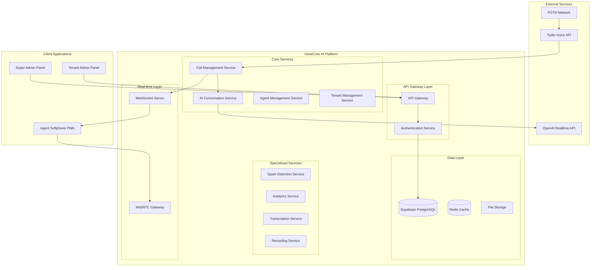

# Design Document - VoiceCore AI

## Overview

VoiceCore AI is a comprehensive multitenant enterprise virtual receptionist system that combines advanced AI capabilities with robust telecommunications infrastructure. The system leverages Twilio for voice communications, OpenAI's Realtime API for intelligent conversations, and Supabase for scalable data management with row-level security.

The architecture follows a microservices pattern with real-time communication capabilities, supporting thousands of concurrent calls across multiple tenants while maintaining strict data isolation and security standards.

## Architecture

### High-Level Architecture



### Multitenant Architecture Pattern

The system implements a **Shared Database, Row-Level Security (RLS)** pattern using Supabase PostgreSQL:

- **Single Database Instance**: All tenants share the same database for cost efficiency
- **Row-Level Security**: PostgreSQL RLS policies ensure complete data isolation
- **Tenant Context**: Every request includes tenant_id for proper data scoping
- **Schema Sharing**: Common schema with tenant_id columns in all tables

This approach provides the optimal balance of cost efficiency, security, and operational simplicity for enterprise SaaS applications.

## Components and Interfaces

### 1. Call Management Service

**Responsibilities:**
- Handle incoming/outgoing calls via Twilio
- Route calls to appropriate handlers (AI, agents, voicemail)
- Manage call state and transitions
- Implement call queuing and prioritization

**Key Interfaces:**
```typescript
interface CallManager {
  handleIncomingCall(callSid: string, from: string, to: string): Promise<CallResponse>
  transferCall(callSid: string, targetAgent: string): Promise<void>
  endCall(callSid: string): Promise<void>
  getCallStatus(callSid: string): Promise<CallStatus>
}

interface CallResponse {
  action: 'ai_handle' | 'transfer' | 'queue' | 'reject'
  twimlResponse: string
  metadata?: Record<string, any>
}
```

### 2. AI Conversation Service

**Responsibilities:**
- Manage OpenAI Realtime API connections
- Handle voice-to-voice conversations
- Implement conversation context and memory
- Execute transfer logic based on conversation flow

**Key Interfaces:**
```typescript
interface AIConversationService {
  startConversation(callSid: string, tenantConfig: TenantConfig): Promise<void>
  handleAudioStream(callSid: string, audioData: Buffer): Promise<void>
  endConversation(callSid: string): Promise<ConversationSummary>
}

interface TenantConfig {
  tenantId: string
  companyName: string
  voiceSettings: VoiceConfig
  knowledgeBase: KnowledgeBase
  transferRules: TransferRule[]
}
```

### 3. Agent Management Service

**Responsibilities:**
- Track agent availability and status
- Manage agent authentication and sessions
- Handle agent-to-agent communications
- Implement department hierarchies

**Key Interfaces:**
```typescript
interface AgentService {
  updateAgentStatus(agentId: string, status: AgentStatus): Promise<void>
  getAvailableAgents(tenantId: string, department?: string): Promise<Agent[]>
  assignCall(callSid: string, agentId: string): Promise<void>
  getAgentMetrics(agentId: string, timeRange: TimeRange): Promise<AgentMetrics>
}

enum AgentStatus {
  AVAILABLE = 'available',
  BUSY = 'busy',
  NOT_AVAILABLE = 'not_available'
}
```

### 4. Spam Detection Service

**Responsibilities:**
- Analyze incoming calls for spam indicators
- Maintain blacklist/whitelist databases
- Implement configurable detection rules
- Provide real-time spam scoring

**Key Interfaces:**
```typescript
interface SpamDetectionService {
  analyzeCall(phoneNumber: string, tenantId: string): Promise<SpamScore>
  updateSpamRules(tenantId: string, rules: SpamRule[]): Promise<void>
  reportSpam(phoneNumber: string, tenantId: string): Promise<void>
}

interface SpamScore {
  score: number // 0-100, higher = more likely spam
  reasons: string[]
  action: 'allow' | 'block' | 'challenge'
}
```

### 5. Real-time Communication Layer

**WebSocket Server:**
- Agent status updates
- Call notifications
- Real-time dashboard data
- System alerts

**WebRTC Gateway:**
- Browser-based calling for agents
- Audio stream management
- Call quality monitoring
- Fallback to PSTN when needed

## Data Models

### Core Entities

```sql
-- Tenants table with RLS
CREATE TABLE tenants (
  id UUID PRIMARY KEY DEFAULT gen_random_uuid(),
  name VARCHAR(255) NOT NULL,
  domain VARCHAR(255) UNIQUE,
  settings JSONB DEFAULT '{}',
  created_at TIMESTAMP WITH TIME ZONE DEFAULT NOW(),
  updated_at TIMESTAMP WITH TIME ZONE DEFAULT NOW()
);

-- Enable RLS
ALTER TABLE tenants ENABLE ROW LEVEL SECURITY;

-- Agents table
CREATE TABLE agents (
  id UUID PRIMARY KEY DEFAULT gen_random_uuid(),
  tenant_id UUID REFERENCES tenants(id) ON DELETE CASCADE,
  email VARCHAR(255) NOT NULL,
  name VARCHAR(255) NOT NULL,
  extension VARCHAR(10),
  department VARCHAR(100),
  status agent_status DEFAULT 'not_available',
  settings JSONB DEFAULT '{}',
  created_at TIMESTAMP WITH TIME ZONE DEFAULT NOW(),
  updated_at TIMESTAMP WITH TIME ZONE DEFAULT NOW()
);

-- Enable RLS for agents
ALTER TABLE agents ENABLE ROW LEVEL SECURITY;

-- RLS Policy for agents
CREATE POLICY agents_tenant_isolation ON agents
  USING (tenant_id = current_setting('app.current_tenant')::UUID);

-- Calls table
CREATE TABLE calls (
  id UUID PRIMARY KEY DEFAULT gen_random_uuid(),
  tenant_id UUID REFERENCES tenants(id) ON DELETE CASCADE,
  twilio_call_sid VARCHAR(255) UNIQUE NOT NULL,
  from_number VARCHAR(20) NOT NULL,
  to_number VARCHAR(20) NOT NULL,
  agent_id UUID REFERENCES agents(id),
  status call_status DEFAULT 'initiated',
  duration INTEGER DEFAULT 0,
  recording_url TEXT,
  transcript TEXT,
  metadata JSONB DEFAULT '{}',
  created_at TIMESTAMP WITH TIME ZONE DEFAULT NOW(),
  ended_at TIMESTAMP WITH TIME ZONE
);

-- Enable RLS for calls
ALTER TABLE calls ENABLE ROW LEVEL SECURITY;
CREATE POLICY calls_tenant_isolation ON calls
  USING (tenant_id = current_setting('app.current_tenant')::UUID);

-- Knowledge base for AI training
CREATE TABLE knowledge_base (
  id UUID PRIMARY KEY DEFAULT gen_random_uuid(),
  tenant_id UUID REFERENCES tenants(id) ON DELETE CASCADE,
  question TEXT NOT NULL,
  answer TEXT NOT NULL,
  category VARCHAR(100),
  priority INTEGER DEFAULT 0,
  active BOOLEAN DEFAULT true,
  created_at TIMESTAMP WITH TIME ZONE DEFAULT NOW(),
  updated_at TIMESTAMP WITH TIME ZONE DEFAULT NOW()
);

-- Enable RLS for knowledge base
ALTER TABLE knowledge_base ENABLE ROW LEVEL SECURITY;
CREATE POLICY knowledge_base_tenant_isolation ON knowledge_base
  USING (tenant_id = current_setting('app.current_tenant')::UUID);

-- Spam detection rules
CREATE TABLE spam_rules (
  id UUID PRIMARY KEY DEFAULT gen_random_uuid(),
  tenant_id UUID REFERENCES tenants(id) ON DELETE CASCADE,
  rule_type VARCHAR(50) NOT NULL, -- 'keyword', 'pattern', 'number'
  rule_value TEXT NOT NULL,
  action VARCHAR(20) DEFAULT 'block', -- 'block', 'flag', 'challenge'
  weight INTEGER DEFAULT 10,
  active BOOLEAN DEFAULT true,
  created_at TIMESTAMP WITH TIME ZONE DEFAULT NOW()
);

-- Enable RLS for spam rules
ALTER TABLE spam_rules ENABLE ROW LEVEL SECURITY;
CREATE POLICY spam_rules_tenant_isolation ON spam_rules
  USING (tenant_id = current_setting('app.current_tenant')::UUID);
```

### Enums and Types

```sql
CREATE TYPE agent_status AS ENUM ('available', 'busy', 'not_available');
CREATE TYPE call_status AS ENUM ('initiated', 'ringing', 'in_progress', 'completed', 'failed', 'no_answer');
CREATE TYPE call_direction AS ENUM ('inbound', 'outbound');
```

### Tenant Context Management

```sql
-- Function to set tenant context
CREATE OR REPLACE FUNCTION set_tenant_context(tenant_uuid UUID)
RETURNS void AS $$
BEGIN
  PERFORM set_config('app.current_tenant', tenant_uuid::text, true);
END;
$$ LANGUAGE plpgsql;

-- Middleware will call this function before each request
-- Example: SELECT set_tenant_context('tenant-uuid-here');
```

## Correctness Properties

*A property is a characteristic or behavior that should hold true across all valid executions of a system—essentially, a formal statement about what the system should do. Properties serve as the bridge between human-readable specifications and machine-verifiable correctness guarantees.*

Now I need to analyze the acceptance criteria to determine which ones can be tested as properties. Let me use the prework tool to analyze the requirements.

<function_calls>
<invoke name="prework">
<parameter name="featureName">voicecore-ai

Based on the prework analysis, I've identified the following consolidated correctness properties:

### Property 1: Tenant Data Isolation
*For any* two different tenants in the system, data operations for one tenant should never return or modify data belonging to the other tenant
**Validates: Requirements 1.1, 1.3**

### Property 2: Tenant Provisioning Completeness
*For any* newly created tenant, the system should provision all required isolated resources including configuration, database schemas, and default settings
**Validates: Requirements 1.2**

### Property 3: Tenant Data Cleanup
*For any* deleted tenant, all associated data should be completely removed from the system within the specified time limit
**Validates: Requirements 1.4**

### Property 4: AI Language Consistency
*For any* conversation, when the AI detects a caller's language, all subsequent responses in that conversation should be in the same detected language
**Validates: Requirements 2.1**

### Property 5: AI Response Latency
*For any* caller input, the AI should generate and deliver a response within the specified maximum latency threshold
**Validates: Requirements 2.2, 7.5**

### Property 6: AI Transfer Logic
*For any* conversation where assistance attempts fail, the AI should transfer to customer service only after exactly three unsuccessful attempts
**Validates: Requirements 2.6**

### Property 7: Spam Detection and Action
*For any* incoming call that matches configured spam criteria, the system should both detect it as spam and execute the appropriate action (block/flag/challenge)
**Validates: Requirements 3.1, 3.2**

### Property 8: Call Routing Preservation
*For any* call transfer operation, the original caller ID should be preserved and visible to the receiving agent
**Validates: Requirements 3.4**

### Property 9: Extension Routing
*For any* direct extension dial, the call should be routed immediately to the correct agent without going through the AI receptionist
**Validates: Requirements 3.6**

### Property 10: Agent Status Management
*For any* agent status change, the new status should be persisted, automatically refreshed at the specified interval, and reflected in real-time to all connected clients
**Validates: Requirements 4.3, 4.4**

### Property 11: Call Activity Logging
*For any* completed call, all required metadata (duration, participants, recordings, transcripts) should be automatically logged and retrievable
**Validates: Requirements 4.6**

### Property 12: Privacy Compliance
*For any* data storage or logging operation, the system should never store IP addresses, geolocation, or location data of agents
**Validates: Requirements 5.1, 5.5**

### Property 13: Data Encryption
*For any* data transmission or storage operation, the data should be encrypted using approved encryption standards
**Validates: Requirements 5.3**

### Property 14: AI Training Integration
*For any* configured question-answer pair in the knowledge base, the AI should use this information when responding to related queries
**Validates: Requirements 6.3**

### Property 15: Credit System Enforcement
*For any* tenant with configured credit limits, the system should track usage and enforce limits according to the tenant's plan
**Validates: Requirements 6.7**

### Property 16: External Service Integration
*For any* call operation, the system should successfully integrate with Twilio for call handling and OpenAI for AI responses
**Validates: Requirements 7.1, 7.2**

### Property 17: Real-time Communication
*For any* status update or call event, the information should be transmitted to connected clients via WebSocket within the specified latency threshold
**Validates: Requirements 7.4**

### Property 18: Call Queue Prioritization
*For any* set of waiting callers, the queue should order them according to configured prioritization rules (VIP status, wait time, etc.)
**Validates: Requirements 8.1, 8.3**

### Property 19: Department Isolation
*For any* department-specific resource (voicemail, agents, etc.), access should be properly isolated and scoped to the correct department
**Validates: Requirements 8.2**

### Property 20: Analytics Generation
*For any* call or system activity, appropriate metrics and analytics should be generated and made available through dashboards and reports
**Validates: Requirements 9.1, 9.2, 9.3**

### Property 21: Automatic Transcription
*For any* completed call, a transcript should be automatically generated and stored for quality review
**Validates: Requirements 6.6, 9.4**

### Property 22: API Functionality
*For any* valid API request, the system should process it correctly and return appropriate responses with proper authentication and rate limiting
**Validates: Requirements 10.1, 10.5**

### Property 23: Webhook Delivery
*For any* configured webhook event, the system should deliver notifications to the specified endpoints reliably
**Validates: Requirements 10.2**

### Property 24: Data Export Consistency
*For any* data export operation, the exported data should be in the specified format and contain all requested information
**Validates: Requirements 10.4**

### Property 25: Auto-scaling Response
*For any* increase in concurrent call volume, the system should automatically scale resources to maintain performance
**Validates: Requirements 11.1**

### Property 26: Failover Recovery
*For any* system component failure, automatic failover should occur and service should be restored without data loss
**Validates: Requirements 11.2**

### Property 27: Capacity Handling
*For any* tenant, the system should handle up to the specified maximum number of concurrent calls without degradation
**Validates: Requirements 11.3**

### Property 28: AI Learning Integration
*For any* successful call resolution pattern, the system should learn from it and improve future responses
**Validates: Requirements 12.3**

## Error Handling

### Error Categories and Strategies

**1. External Service Failures**
- **Twilio API Failures**: Implement circuit breaker pattern with exponential backoff
- **OpenAI API Failures**: Fallback to pre-recorded messages and immediate agent transfer
- **Database Failures**: Use read replicas and connection pooling with retry logic

**2. Call Quality Issues**
- **High Latency**: Automatic region switching and CDN optimization
- **Audio Quality Problems**: Codec negotiation and bandwidth adaptation
- **Connection Drops**: Automatic reconnection with state preservation

**3. Security Incidents**
- **Spam Detection Failures**: Manual review queue and learning feedback loop
- **Authentication Failures**: Account lockout and security team notifications
- **Data Breach Attempts**: Immediate isolation and forensic logging

**4. Tenant-Specific Errors**
- **Configuration Errors**: Validation at input time with rollback capabilities
- **Credit Exhaustion**: Graceful degradation with notification system
- **Agent Unavailability**: Intelligent routing to backup agents or voicemail

### Error Recovery Patterns

```typescript
// Circuit breaker for external services
class ServiceCircuitBreaker {
  private failureCount = 0;
  private lastFailureTime = 0;
  private state: 'CLOSED' | 'OPEN' | 'HALF_OPEN' = 'CLOSED';
  
  async call<T>(operation: () => Promise<T>): Promise<T> {
    if (this.state === 'OPEN') {
      if (Date.now() - this.lastFailureTime > this.timeout) {
        this.state = 'HALF_OPEN';
      } else {
        throw new Error('Circuit breaker is OPEN');
      }
    }
    
    try {
      const result = await operation();
      this.onSuccess();
      return result;
    } catch (error) {
      this.onFailure();
      throw error;
    }
  }
}

// Retry with exponential backoff
async function withRetry<T>(
  operation: () => Promise<T>,
  maxRetries: number = 3,
  baseDelay: number = 1000
): Promise<T> {
  for (let attempt = 1; attempt <= maxRetries; attempt++) {
    try {
      return await operation();
    } catch (error) {
      if (attempt === maxRetries) throw error;
      
      const delay = baseDelay * Math.pow(2, attempt - 1);
      await new Promise(resolve => setTimeout(resolve, delay));
    }
  }
  throw new Error('Max retries exceeded');
}
```

## Testing Strategy

### Dual Testing Approach

The VoiceCore AI system requires comprehensive testing using both unit tests and property-based tests to ensure correctness across all scenarios.

**Unit Tests** focus on:
- Specific examples and edge cases
- Integration points between services
- Error conditions and boundary cases
- Mock external service responses

**Property-Based Tests** focus on:
- Universal properties that hold for all inputs
- Comprehensive input coverage through randomization
- Tenant isolation and security properties
- Performance characteristics under load

### Property-Based Testing Configuration

**Testing Framework**: We will use **fast-check** for JavaScript/TypeScript property-based testing, configured with:
- Minimum 100 iterations per property test
- Custom generators for domain-specific data (phone numbers, tenant IDs, call scenarios)
- Shrinking enabled for minimal failing examples

**Test Organization**: Each correctness property will be implemented as a single property-based test with the following tag format:
- **Feature: voicecore-ai, Property 1: Tenant Data Isolation**
- **Feature: voicecore-ai, Property 2: Tenant Provisioning Completeness**
- And so on for all 28 properties

### Integration Testing Strategy

**Real-time Communication Testing**:
- WebSocket connection stability under load
- WebRTC call quality metrics
- Latency measurements for AI responses

**External Service Integration Testing**:
- Twilio webhook handling and call flow
- OpenAI Realtime API conversation management
- Supabase RLS policy enforcement

**Multitenant Testing**:
- Concurrent tenant operations
- Data isolation verification
- Performance under multi-tenant load

### Performance Testing

**Load Testing Scenarios**:
- 1000 concurrent calls per tenant
- Multiple tenants with simultaneous peak loads
- AI response latency under various loads
- Database query performance with RLS

**Monitoring and Alerting**:
- Real-time performance dashboards
- Automated alerts for SLA violations
- Capacity planning based on usage patterns

The testing strategy ensures that both functional correctness and performance requirements are validated through automated testing, with property-based tests providing comprehensive coverage of the system's behavioral guarantees.